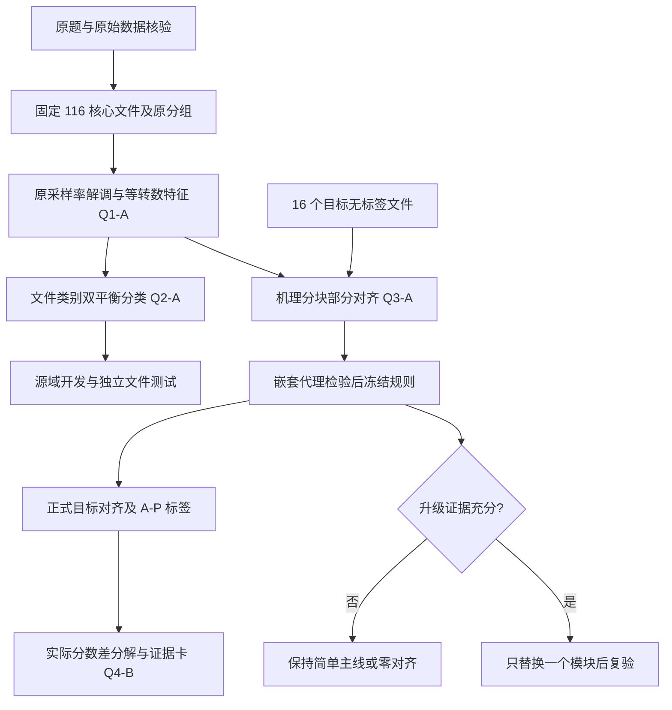

# 高速列车轴承诊断：创新建模方案与模型适配预处理

本报告重新选择 2025 年中国研究生数学建模竞赛 E 题的方法。每问给出 A「基础模型＋改进点」、B「创新融合型模型」、C「冲奖探索模型」三个层次，共 12 个候选方案；每个方案只指定一个主创新类型：①算法改进，②跨领域模型迁移，③多模型融合组合。层次表示研究投入，类型表示创新来自哪里，二者不等同。候选方案供选择，不要求把三个层次叠加。

**建议主线为 Q1-A → Q2-A → Q3-A → Q4-B。** 将主要研究投入放在“转速差异下的特征可比性”和“有限样本下的保守域对齐”，以可计算的决策变化解释迁移结果。Q3-C 的非平衡最优传输是优先的冲奖对照方向，须有独立验证增益才升级为主模型。

当前证据包括题目原文、数据审计和已生成的预处理数据集。以下算法、参数网格及实验均为待实施设计；“真实创新点”明确指相对于本文基线的实质改动，不是已经证明的精度提升或学术首创。“冲奖”表示可形成较深入研究的候选，不能据此预测获奖。

## 一、数据事实、重新选源域与统一验证合同

### 1.1 数据决定模型规模

| 已核验事实 | 对模型设计的直接影响 |
|---|---|
| 源域 161 文件：OR 77、IR 40、B 40、N 4 | 训练目标需同时平衡类别与文件；窗口数不能充当独立样本数 |
| 目标域 A—P 共 16 文件，每文件 32 kHz、8 s、单通道，约 600 rpm | 可使用无标签统计量；输出单位必须是文件；转速只能作近似标定 |
| 源域转速约 1718—1798 rpm | 等时间窗口对应不同转数；需比较等时间与等转数表征 |
| 目标轴承几何、测点名称、振动幅值物理单位未知 | 不把源域理论故障频率硬套目标域；不进行无依据的物理单位换算 |
| DE 覆盖 161 文件，FE 覆盖 153，BA 覆盖 97 | 主输入采用 DE；目标使用唯一通道；缺失通道不补零 |
| 已有原采样率去均值版本和 12 kHz 单通道版本；已有 1196 个一秒窗口 | 可直接作为基线；等转数、包络和新模型特征须重新生成，不能宣称已经存在 |
| 已有划分为源域 96/32/33 个训练/验证/测试文件；训练仅 2 个 N 文件 | 测试封存；训练内部最多作含正常类的二折分组调参，禁止默认五折 |

原数据没有需要插补的 NaN/Inf；高峭度和大冲击可能是故障证据。预处理只标记疑似削顶、滤波边界和相关通道，不按模型预测好坏删数据。目标文件 B、N 是编号，标签仍未知。[D1–D4]

### 1.2 源域筛选的具体建议

首选同一故障轴承体系的子集：`12kHz_DE_data` 60 文件、`48kHz_DE_data` 52 文件、`48kHz_Normal_data` 4 文件，合计 116 文件，类别为 N 4、OR 56、IR 28、B 28。该子集的故障轴承为 SKF6205，主观测为 DE。保留另 45 个 `12kHz_FE_data` 文件作为扩展训练和跨轴承条件对照：其中故障轴承为 SKF6203，不能因同样读取 DE 信号就认为故障轴承相同。

这个筛选依据是已知采集结构的一致性，不是断言目标轴承等于 SKF6205，也不是根据测试准确率挑样本。继承既有文件划分后，116 文件子集为训练 70、验证 23、测试 23；训练仍只有 2 个 N 文件。全 161 文件训练方案与该方案应在相同的 23 个核心测试文件上比较；其余 10 个既有测试文件可作为扩展条件测试，分别报告结果。45 个 FE 故障文件不得全部回流训练，其中原有验证、测试归属保持不变。

### 1.3 所有方案共同遵守的实验协议

- 先按原文件及已发现的跨记录关联分组，再切窗、扩增、缩放。已知 5 对 DE/FE 时移对应关系属于同文件，不重复计作独立样本。
- 第一层调参仅使用源域训练文件，采用能让每个训练折保留 N 类的二折分组验证；第二层以既有验证文件做一次有限方案选择；测试文件只用于冻结方案后的最终评价。反复更换随机种子不能增加独立正常文件数。
- 源域主指标为文件级宏平均 F1、各类召回率和平衡准确率，另报混淆矩阵、推理耗时。明确正常类测试只含 1 个文件，报告“正确文件数/总文件数”；其统计精度不靠窗口自助抽样改善。
- 代理迁移用开发文件中的 12/48 kHz DE 条件互换，先检查类别交集及文件关联；该代理仅包含 OR/IR/B。工况留出也先列出类别支持，缺类时缩小评价任务并明示。代理训练标签可用，代理目标标签仅供外层评分；调参必须另用开发层内部代理划分，不能反复查看同一代理评分集。
- 正式 A—P 可无标签参与域统计，属对给定数据的传导式迁移。不得用目标伪标签、漂亮聚类图或预测类别配额调参；目标稳定性指标不能代替目标准确率。
- 所有下文数值网格均是预先提出的实验预算，不是题面事实或已证实的最佳值。采用少量逐层对照；复杂方案无稳定增益时回到简单方案。

### 1.4 共用符号与输入边界

文件为 $i$，其窗口为 $j$，训练文件数为 $n$，该文件窗口数为 $m_i$；类别 $y_i\in\{\mathrm N,\mathrm{OR},\mathrm{IR},\mathrm B\}$，训练类别数为 $K$（正式任务为 4，三类代理为 3），类别文件数为 $N_c$。$x_i(t)$ 为原始尺度振动，$r_i$ 为转频（Hz），$z_{ij}\in\mathbb R^d$ 为选中特征。$f_c(z)$ 为类别决策分数，不默认是概率。$\phi$ 表示特征提取，$\Theta$ 表示待估模型参数。

转速用于频率轴和窗口构造；载荷、故障尺寸、目录、测点可用性、文件编号及疑似削顶标记用于分组或审计，不直接作为分类输入。特征的训练中心与尺度、特征筛选、核参数和任何概率校准都在相应训练折重新估计。预处理已有 `scaler.json` 只适用于其原划分与原六列特征。

## 二、问题一：数据筛选与故障特征提取

本问应交付筛选清单、代表信号的机理分析、全体入选文件的特征表。以下三种方案都使用 1.2 节的可审计选源域规则。

### Q1-A 基础模型＋改进点：包络分析与等转数稳定特征筛选

创新类型：①算法改进创新。实现难度：中；首选。

#### 1. 核心原理

先从振动中提取冲击的强弱变化，即包络；再比较每转发生多少次重复波动。对约 1800 rpm 与 600 rpm 的记录，直接比较同一秒或相同 Hz 峰值容易混入速度差异。用相同转数切窗，并把包络频率除以转频，得到无量纲阶次，重点提取冲击性、谐波集中程度和调制结构。[R1]

#### 2. 场景适配性

只需已有单通道信号、名义采样率和转速来源，适合 116 个核心源文件及 16 个目标文件。源域几何只用于核对代表性源信号的理论故障频率；目标侧使用几何无关的谱形和峰间结构。阶次消除的是转速尺度，轴承几何与传递路径差异仍保留。

#### 3. 真实创新点

相对于“固定一秒＋几个时域指标”，增加等转数观察、近似转速扰动检验和按文件重采样的稳定特征选择。候选特征在许多窗口上显著、但只由一个源文件支撑时，不认定为稳定证据。待检验收益是：相同文件评估中宏 F1 不下降，同时速度标定误差下的特征漂移、标签翻转率下降；若只有源域准确率增加而代理迁移变差，不采纳。

#### 4. 模型局限性和规避方案

目标 600 rpm 不是实测瞬时转速；等转数只在窗内近似匀速时成立。以 540/600/660 rpm 作 ±10% 压力情景，另作 ±5% 扰动；这不是测量置信区间。主线比较 10/20 转窗口及原一秒窗口，目标名义窗长分别 1/2 s；长窗减少文件内观测数。曾考虑的 40 转窗不满足全体核心文件覆盖：训练文件 `48kHz_DE_data/IR/0014/IR014_0.mat` 约 1.328917 s、1796 rpm，仅约 39.778906 转，因此剔除这一候选，不删文件或重复补窗。固定的机械共振频带先在 Hz 轴解调，再换算包络阶次，不能先伸缩原波形，把共振频率也误当转速量。若转速变化导致严重谱展宽，回退到不依赖 RPM 的归一化谱形特征。

#### 5. 建模核心过程

1. 场景抽象：一个文件是一个轴承状态，窗内冲击与调制是局部观测，采样率和平均转速是观测条件。
2. 变量定义：设每窗转数 $R$，时长 $T_i=R/r_i$，阶次 $o=f/r_i$；在固定带通后的信号上取解析包络 $e_i(t)=|x_i^{\mathrm{band}}(t)+\mathrm j\mathcal H[x_i^{\mathrm{band}}](t)|$，$\mathcal H$ 为希尔伯特变换。
3. 模型构建：特征包括一次交流 RMS、峭度、峰值因子、包络谱熵、峰间距比、谐波集中度及调制能量比。RMS 与“均方根”是同一量，不重复列入。共同 Hz 频带上界初设 5 kHz，留出 12 kHz 抗混叠过渡带；频带和峰搜索规则只由训练数据确定。训练折内用文件中位特征计算 Fisher 区分分数，去除绝对 Spearman 相关系数超过 0.9 的冗余列，再按文件分层重采样统计入选率；候选预算 8—12 维，若有效特征不足则使用较少维数。
4. 数据适配：从连续原采样率或连续 12 kHz 信号重新切窗，不拼接既有归一化一秒窗口；包络先整段计算并处理边界，低通后才允许重采样包络阶次网格。每个候选窗长须在滤波边界裁除和全部预设转速扰动后，仍满足固定文件集合内所有 $m_i\ge1$；不满足则拒绝候选窗长/滤波组合，而非删文件、补零或重复造窗。保留未归一化幅值支路和单位 RMS 形状支路；训练折重新缩放。
5. 求解迭代：固定下游 Q2-A，比对一秒、等转数、等转数加稳定筛选；每轮仅改变一个模块，源域开发结果决定维数和 $R$，不依据 A—P 预测调整峰的位置。
6. 结果验证：输出代表性源域的理论频率核验图、每文件特征、入选频率及速度扰动曲线；以相同外层文件评价特征增益。目标域谱峰仅标为观测峰，几何未知时不强行标作 BPFO/BPFI。

### Q1-B 创新融合型模型：包络机理特征与小波包能量的分组融合

创新类型：③多模型融合组合创新。实现难度：中。

#### 1. 核心原理

包络特征回答“冲击如何重复”，小波包能量回答“瞬态能量落在哪些频带”。先各自形成小型表征，再让带稀疏约束的分类目标选择有互补价值的特征块；不把两套指标直接全量拼接。

#### 2. 场景适配性

背景干扰可能遮蔽清楚的谐波，而宽频带能量仍有信息；反之，未知传感器增益会改变幅值，而包络结构仍可用。两路使用同一主通道，目标不需要新增传感器；维数控制在小样本能支持的范围。

#### 3. 真实创新点

融合位置在“物理互补表征”，加入整块选择约束，自动舍弃无用支路。与单独包络、小波包及直接拼接三种对照相比，只有在文件级指标或噪声鲁棒性提高、且至少两块有独立贡献时才保留融合；若一块系数整体归零，就交付单支路方案。

#### 4. 模型局限性和规避方案

小波层数和边界扩展会改变能量，小波包可能主要识别设备条件。限制为 3/4 层、两种预先指定小波基；做增益 0.5/1/2 倍、加噪和边界裁除实验。能量比例作对数比变换时需固定微小正数并做量级敏感性。每块按训练尺度及维数校正，防止“列多”自然占优。

#### 5. 建模核心过程

1. 场景抽象：同一故障存在周期调制和分频带能量两种互补观测。
2. 变量定义：$z^{(1)}$ 为包络特征，$z^{(2)}$ 为小波包能量比例；$B_1,B_2$ 为多分类逻辑回归的两块系数。
3. 模型构建：用 $p(y|z)=\operatorname{softmax}(b+B_1^\mathsf Tz^{(1)}+B_2^\mathsf Tz^{(2)})$ 作筛选探针，最小化文件类别平衡交叉熵加 $\lambda_1\sum_g\|B_g\|_F+\lambda_2\|B\|_1$；第一项控制整块，第二项控制块内列。非零特征传给第二问，不把探针性能当最终诊断结果。
4. 数据适配：包络沿用 Q1-A；小波包采用共同 12 kHz 网格与同一时间区间，固定扩展模式。归一化子带能量，保留总能量为单独幅值量，全部变换在训练折拟合。
5. 求解迭代：小网格选择分解层数、两项正则；每折重建筛选器，观察两块选择是否稳定，再交给固定的 Q2-A。
6. 结果验证：比较三种对照及分块消融，输出两块选择率、训练维数和跨采样条件表现；融合贡献未超过折间波动时选 Q1-A。

### Q1-C 冲奖探索模型：稀疏反演与周期一致性约束的冲击恢复

创新类型：②跨领域模型迁移创新，从稀疏逆问题迁移到轴承冲击恢复。实现难度：高。

#### 1. 核心原理

把观测振动理解为“稀疏冲击经过结构传播后的振铃＋其他振动”。尝试同时估计冲击序列与传播响应，把被混响遮蔽的重复冲击还原出来。铁路轴承已有不要求预先输入故障频率的盲反卷积研究，可作已有方法对照。[R2]

#### 2. 场景适配性

目标几何未知，固定故障周期的滤波器容易错配；因此仅约束冲击稀疏和相邻片段的重复结构。适合确有强振铃或背景干扰、且 Q1-A 不能提取稳定包络特征的文件。

#### 3. 真实创新点

拟在传统稀疏反卷积中加入相邻子窗冲击能量自相关的一致性，降低单个偶发大冲击被当故障的倾向。相对于只最大化峭度，优化目标同时解释波形和周期证据。待检验收益是已知注入冲击的恢复误差下降、实测文件诊断更稳；合成实验只能验证恢复机制，不能证明目标标签正确。

#### 4. 模型局限性和规避方案

传播响应和冲击不是唯一可辨识的，稀疏优化可能“造出”规则冲击。固定响应能量、首个有效位置及长度上限，限制阻尼响应族；多初值重启并保存残差。目标周期未知，不按源域 BPFO 指定目标脉冲间隔。若相邻窗本来不平稳，一致性项会抹掉变化，须扫描该项权重至 0，并与 Q1-A 和原反卷积法比较。

#### 5. 建模核心过程

1. 场景抽象：$x=h*u+\epsilon$，其中 $h$ 是有限长传播响应，$u$ 是稀疏冲击序列，$*$ 表示卷积，$\epsilon$ 是未解释残差。
2. 变量定义：待估 $h,u$；$h$ 固定单位二范数，长度候选以毫秒定义；$C_q(u)$ 为第 $q$ 个子窗冲击平方序列在固定滞后区间的归一化自相关向量。零能量时将该向量置零并标记，避免除零。
3. 模型构建：最小化 $\tfrac12\|x-h*u\|_2^2+\lambda_u\|u\|_1+\lambda_p\sum_q\|C_q(u)-C_{q+1}(u)\|_2^2$。$u$ 与 $x$ 采用一致幅值口径；$\lambda_u,\lambda_p$ 按归一化后各项量级确定并在开发集选择。该非凸扩展是本文候选，已有文献不为其提供收敛或性能保证。
4. 数据适配：用原采样率信号，先保存幅值再归一化；按连续片段反演并按滤波支撑裁去边界。恢复后才提取特征；不同采样率下响应长度换成相同物理时间。
5. 求解迭代：交替更新稀疏 $u$ 和约束响应 $h$，非凸一致性项用局部梯度及回溯；目标函数不下降则拒绝本次更新，记录局部解和重启差异，不宣称全局最优。
6. 结果验证：合成冲击注入试验评估定位和能量恢复，实测评估文件级分类及重复初始化稳定性；去掉周期项作消融。恢复结构随初值剧变或源域泛化变差时停用。

## 三、问题二：源域故障诊断

### Q2-A 基础模型＋改进点：文件—类别双重平衡的 RBF-SVM

创新类型：①算法改进创新。实现难度：低—中；首选。

#### 1. 核心原理

支持向量机（Support Vector Machine，SVM）在特征空间划分类别边界；径向基函数（Radial Basis Function，RBF）核允许非线性。改进重点是损失怎么记账：每个类别总权重相同，同类的每个文件总权重相同，长文件切出更多窗口也不会变得更有话语权。

#### 2. 场景适配性

源域类别不平衡、文件长短不同，只有少量独立正常文件；中低维特征加小参数分类器比大网络更容易做诚实的分组验证。不要求目标标签；分类分数可直接用于第三问和解释。

#### 3. 真实创新点

传统按窗口计算 `class_weight` 仍会受每类文件长度影响。设每窗权重 $a_{ij}=1/(K N_{y_i}m_i)$，每类总和严格等于 $1/K$。与“仅类权重”的前版建议相比，此处将文件平衡写入训练目标，并配套文件级汇总及分组调参。预期收益是减少长记录主导和少数类漏诊；是否提高精度由消融决定。

#### 4. 模型局限性和规避方案

权重不能凭空增加正常工况，两份正常训练文件可能被过度拟合。限制核宽度与惩罚系数搜索范围，保留线性核对照；报告正常类逐文件决策。原生 SVM 分数不是概率，主报告使用间隔和投票比例；若另行校准，只用按文件产生的训练外分数，正常类极少时不输出看似精确的置信概率。

#### 5. 建模核心过程

1. 场景抽象：带标签文件生成相关窗口，学习目标是泛化到新文件的四类识别。
2. 变量定义：四个一对其余分类分数 $f_c$，$t_{ic}=+1$ 当 $y_i=c$、否则为 $-1$；$a_{ij}$ 如上，$K(z,z')=\exp(-\gamma\|z-z'\|_2^2)$。
3. 模型构建：对每类最小化 $\tfrac12\|f_c\|_{\mathcal H}^2+C\sum_{ij}a_{ij}\max(0,1-t_{ic}f_c(z_{ij}))$，偏置不正则化。将权重一次性传入求解器，关闭自动类别加权，防止重复加权。文件分数固定为窗口分数的算术均值 $s_{ic}=m_i^{-1}\sum_jf_c(z_{ij})$，标签为最大分数类别；中位数仅作鲁棒性对照。
4. 数据适配：使用 Q1 的特征白名单；训练折内按文件等权估计中心和尺度，而非直接复用现有窗口等权 scaler；重算文件窗口数和权重。相同原文件的原始、等转数和扩增版本共用分组。
5. 求解迭代：按源训练二折选择 $C,\gamma$，既有验证集比较有限方案，测试封存；先做不加权、仅类平衡、双重平衡三项对照。
6. 结果验证：按文件输出主指标和混淆矩阵；汇报每类总权重检验、特征尺度、少数类错误文件及幅值/噪声扰动表现。若双重平衡只提高总体准确率而降低正常类召回，不认定有综合收益。

### Q2-B 创新融合型模型：幅值与形状双视图的稀疏加性分类

创新类型：③多模型融合组合创新。实现难度：中。

#### 1. 核心原理

将“振动有多强”和“冲击长什么样”分别建成低维评分，再相加判断故障。每个指标可画一条响应曲线，直接观察它如何改变类别分数；形状分支提供对未知增益的适应，幅值分支保留正常/故障可能存在的能量差异。

#### 2. 场景适配性

已有数据同时保存单位 RMS 波形和幅值恢复量，两路都真实可得。使用少结点样条及稀疏约束，适合小样本；比任意加入第二个黑箱网络更容易识别互补信息。

#### 3. 真实创新点

改进来自幅值—形状职责分离及分支收缩，替代不可解释的全特征非线性拟合。若去掉幅值分支能保持迁移性能，则主动简化；若保留能改善 N 类识别且增益扰动下稳定，才接受双视图。该创新主要提高可用性和解释透明度，精度优势须与 Q2-A 实测比较。

#### 4. 模型局限性和规避方案

加性模型表达复杂交互有限；大幅值并不总对应故障。每特征仅用少量训练分位点样条，惩罚曲率和整组系数；不对峭度或 RMS 强加“越大越故障”的单调假设。相关指标成组保留或剔除，检验增益、通道条件和未知区间外推。若需很多交互项才达到基线性能，放弃该方案。

#### 5. 建模核心过程

1. 场景抽象：文件状态由幅值证据和无量纲形状证据共同解释。
2. 变量定义：幅值集合 $\mathcal A$、形状集合 $\mathcal S$，样条函数 $g_{ck}$，类分数 $f_c(z)=b_c+\sum_{k\in\mathcal A}g_{ck}(z_k)+\sum_{k\in\mathcal S}g_{ck}(z_k)$。
3. 模型构建：以 softmax 交叉熵、Q2-A 的 $a_{ij}$ 权重及样条曲率/分组稀疏惩罚联合拟合；各响应函数训练均值约束为 0，固定一个参考类消除参数不唯一。按文件平均分数分类。
4. 数据适配：幅值取未归一化交流量，必要时作 $\log(1+x/s)$，$s$ 为训练正尺度；形状支路保持无量纲，结点及缩放都只由训练文件确定。
5. 求解迭代：凸样条系数优化，逐层比较仅形状、两路相加及两路加稀疏惩罚；正则强度在相同分组协议选择。
6. 结果验证：与 Q2-A 比较宏 F1、N 类召回和推理开销；画响应曲线和文件级加性分数核算，改变幅值增益时检查贡献是否异常主导。

### Q2-C 冲奖探索模型：文件级分布鲁棒分类与受限难样本加权

创新类型：②跨领域模型迁移创新，将分布鲁棒风险优化用于跨条件诊断。实现难度：中—高。

#### 1. 核心原理

普通模型优化平均错误，可能牺牲少数难工况。这里假设未来数据对现有文件的重视程度会改变，在允许的权重范围内，优先降低较坏情形的损失，同时限制单个文件的最大权重。[R3]

#### 2. 场景适配性

源域载荷和采集条件不同，但许多“类别×条件”组合样本很少。直接做细碎的群组最坏风险不稳定，因此以文件为基本单位、保持每类总权重，避免让正常类全部被多数类挤出。

#### 3. 真实创新点

在 Q2-A 的固定权重上引入“类内可变、单文件受限”的对抗权重；创新对象是训练风险，不是再加一个网络。与普通类平衡、无限制难例加权相比，考察开发层留出工况的最差性能是否改善，并检查平均宏 F1 的损失是否可接受。

#### 4. 模型局限性和规避方案

困难文件可能是测量异常，也可能是罕见但有效的故障。无限追踪大损失会过拟合，所以设置权重上限和正则化，不按“大损失”删除文件。对正常类只有 2 个训练文件时，鲁棒空间十分有限；扫描鲁棒强度，并逐文件留出诊断影响。不把源域最坏风险改善当作真实目标域保证。

#### 5. 建模核心过程

1. 场景抽象：文件分布可能变化，类别依然是题目四类，模型须对合理权重变化稳定。
2. 变量定义：$L_i(\Theta)=m_i^{-1}\sum_j\ell(f_\Theta(z_{ij}),y_i)$；$q_i$ 是文件风险权重，$\kappa\ge1$ 是容许集中程度，$\Omega(\Theta)$ 为模型正则项。
3. 模型构建：求 $\min_\Theta\max_{q\in\mathcal Q_\kappa}\sum_iq_iL_i(\Theta)+\lambda\Omega(\Theta)$，其中 $\sum_{i:y_i=c}q_i=1/K$、$0\le q_i\le\kappa/(K N_c)$。取 $\kappa=1$ 回到文件类别平衡；候选 1/1.5/2。内层在每类对损失排序并在上限内分配质量，外层拟合加权核分类器或固定低维样条分类器，实际实现选定一种。
4. 数据适配：延用 Q1 特征与训练折缩放；每次先将窗口损失平均到文件，不能让对抗权重直接追踪孤立窗口。
5. 求解迭代：交替计算受限最坏文件权重与正则化分类器，检查原始目标及停止误差；采用固定核的一对其余 hinge 损失时可按凸极小极大问题求解，仍需报告数值收敛证据。
6. 结果验证：比较 $\kappa=1$ 基线、最差支持充分工况得分和全体得分；做权重上限消融、删除单个训练文件的影响诊断。若改进集中在一两个文件且跨划分不稳定，保留 Q2-A。

## 四、问题三：目标域迁移诊断

### Q3-A 基础模型＋改进点：机理分块、收缩估计与部分 CORAL 对齐

创新类型：①算法改进创新。实现难度：中；首选。

#### 1. 核心原理

协方差对齐（CORrelation ALignment，CORAL）调整源域特征的中心和伸缩方向，使其统计形态接近目标域。传统整体强对齐会混合不同机理量；本方案把幅值、冲击形状、包络调制分块，只在同类物理量内部对齐，并允许“只迁移一部分”。[R4]

#### 2. 场景适配性

目标只有 16 个独立文件，无标签但可估计低维统计量；低维协方差方法的参数量可控。源、目标测点及增益未知，部分统计差异确需修正，但并非所有类间差异都应消除。收缩估计缓解小样本下协方差矩阵接近奇异的问题。

#### 3. 真实创新点

相对于前版整体 CORAL，实质改动是机理块约束、文件等权协方差、协方差收缩和对齐强度可退至 0。块间关系不过度旋转，便于解释“改动了哪类信息”。待检验提升是代理迁移文件级宏 F1 改善、少数类未受额外损伤、对删去一个目标文件更稳定；仅协方差距离下降不算成功。

#### 4. 模型局限性和规避方案

总体分布差别也可能来自源、目标类别比例不同，对齐会误伤判别边界。比较不对齐、整体全对齐、分块全对齐和分块部分对齐；代理目标类别比例作不均衡压力试验。目标 16 文件对应的协方差有效信息远少于窗口总数，特征总维数控制在约 8—12，并检查特征值和目标文件留一敏感性。分块不能保证跨几何可识别，正式目标正确率仍不可直接测量。

#### 5. 建模核心过程

1. 场景抽象：故障类别共享，但信号统计发生域偏移；仅对可观测的统计差异作有限修正。
2. 变量定义：第 $g$ 块维数 $d_g$、源/目标均值 $\mu_{s,g},\mu_{t,g}$、协方差 $C_{s,g},C_{t,g}$，收缩率 $\rho\in[0,1]$，对齐强度 $\alpha_g\in[0,1]$。协方差统计每个域内文件等权、每文件内窗口等权，均值与协方差使用同组权重；它们区别于分类损失的类别平衡权重。
3. 模型构建：在源训练缩放坐标中定义 $\widehat C_{d,g}=(1-\rho)C_{d,g}+\rho\operatorname{tr}(C_{d,g})I/d_g+\varepsilon I$，$d\in\{s,t\}$，小正数 $\varepsilon$ 确保正定。采用行向量 $A_g=\widehat C_{s,g}^{-1/2}\widehat C_{t,g}^{1/2}$，映射 $T_g(z)=(1-\alpha_g)z+\alpha_g[(z-\mu_{s,g})A_g+\mu_{t,g}]$。$\alpha_g=0$ 为恒等，1 为收缩后的完整块对齐；收缩和部分对齐时不宣称经验协方差完全相等。
4. 数据适配：Q1 特征按机理固定分块，重估训练尺度；源域训练特征映射为 $T(z_s)$，目标特征保持该训练缩放坐标 $z_t$。源域训练标签原样保留；质量标记只作敏感性分层，绝不进入协方差特征列。
5. 求解迭代：以特征分解计算矩阵平方根，在映射后的源训练特征上重新拟合 Q2-A。先共享一个 $\alpha\in\{0,0.25,0.5,1\}$，$\rho\in\{0.01,0.1,0.3\}$；只有开发代理证据支持，才把幅值块单独设为 0。按 1.3 节嵌套代理流程选参数，冻结后用 A—P 无标签统计拟合正式对齐；保留源模型与对齐模型两个版本。
6. 结果验证：对比上述四项消融，汇报源模型的源域测试结果及独立代理迁移结果；正式 A—P 给出标签、窗口投票比例、决策间隔和目标文件留一标签变化。目标坐标中的新分类器不能直接拿未映射源测试特征冒充目标任务验证。任何代理结论必须附“三类、采集条件差异”的范围说明。

### Q3-B 创新融合型模型：源模型与迁移模型的保守决策融合

创新类型：③多模型融合组合创新。实现难度：中。

#### 1. 核心原理

未迁移模型保留源域判别边界，迁移模型适应新统计环境。两者可能在不同条件下出错，使用一个受验证约束的融合系数结合分数，让过强迁移有回退通道。

#### 2. 场景适配性

无需新增目标标签或第三个模型。适用于 Q3-A 在不同代理条件下有时提升、有时下降，且两条分支确有互补错误的情况；若迁移在所有代理情景一致占优，就无需融合。

#### 3. 真实创新点

融合依据是独立代理条件的最差表现，权重全局固定，目标文件的自报高置信度不决定权重。与“哪个更自信就信哪个”的门控不同，它主动限制负迁移风险。待检验收益是减少迁移后新增错误，且相对单分支的平均得分与成本可接受。

#### 4. 模型局限性和规避方案

两个模型高度相关时融合没有价值；原始 SVM 分数尺度也可能不同。用开发训练外分数确定每分支的一个正尺度，先去除每样本四类共有的分数偏置，再作整分支缩放；不逐目标文件拟合尺度。检查分支错误重合度；融合系数结果若为 0 或 1，直接采用对应单模型。

#### 5. 建模核心过程

1. 场景抽象：不迁移与有限迁移是对域偏移大小的两种假设，共同服务一个文件判断。
2. 变量定义：尺度统一的窗口分数 $\bar f_{0,c}$、$\bar f_{a,c}$，全局权重 $\eta\in[0,1]$；$e$ 为开发代理条件。
3. 模型构建：$f_{\eta,c}=(1-\eta)\bar f_{0,c}+\eta\bar f_{a,c}$；从 $\{0,0.25,0.5,0.75,1\}$ 选择使开发代理最差文件级宏 F1 最大的 $\eta$，平局选离最佳单分支更近的值。权重选择与最终代理报告使用不同层文件。
4. 数据适配：两分支使用完全相同的 Q1 特征、文件及窗口；对齐分支严格遵循 Q3-A 的源/目标坐标处理，各分支缩放来源写入模型元数据。
5. 求解迭代：先冻结两个分支，再比较有限融合权重；不增加目标伪标签迭代。继承窗口均分数的文件汇总，保证解释和预测使用同一函数。
6. 结果验证：对照单分支和简单等权平均，统计融合修正与新增错误文件；报告最差代理性能、平均性能和计算量。A—P 的分支分歧用于标记待复核文件，不判定某分支更正确。

### Q3-C 冲奖探索模型：机理分组代价下的非平衡最优传输

创新类型：②跨领域模型迁移创新，将质量运输优化用于无标签文件匹配。实现难度：中—高；优先冲奖对照。

#### 1. 核心原理

把源域文件的带标签证据看作待运输的质量，寻找它与目标文件之间代价较低的对应。普通平衡运输要求所有质量按既定配额匹配，可能把源域类别比例强加给目标；非平衡运输允许部分证据不被使用。最优传输用于域适应及非平衡求解均有已有理论来源，本方案的新增部分是本题的代价与文件级约束。[R5,R6]

#### 2. 场景适配性

目标只有 16 文件，核心源域也只有 116 文件，文件级运输矩阵较小，不需要深度训练。未知目标类别比例恰好要求放松质量守恒；相似性采用几何无关机理特征，避免用错误理论频率强行配对。

#### 3. 真实创新点

将包络结构、冲击形状和低权重幅值距离分开构造运输代价，并把任务二分类器的类别不一致损失作为可关闭的附加代价；文件等权控制长记录影响。与整体 CORAL、普通平衡运输和仅几何代价的非平衡运输比较，验证是否在有已知真值的代理任务上减少类别混配，特别检验源/目标比例失衡时的表现。

#### 4. 模型局限性和规避方案

无标签条件下，相似并不等于同类；运输仍可能整类错配。若源模型已偏移，类别不一致代价会固化错误，因此必须含其系数为 0 的消融。熵正则过大使标签过度平均，质量惩罚过小使证据消失；报告运输质量、类别占比和参数敏感性。质量近零的目标文件回退源模型标签并标记低支持，绝不遗漏 A—P 标签。

#### 5. 建模核心过程

1. 场景抽象：每个源文件为带标签节点、每个目标文件为无标签节点，学习可解释的软匹配关系。
2. 变量定义：$v_i$ 为每文件各选中特征的中位数与四分位距，训练尺度归一；$P_{ij}\ge0$ 为源文件 $i$ 到目标文件 $j$ 的质量。$a_i=1/n_s$、$b_j=1/n_t$ 是文件参考质量，不是目标类别配额。$d_g$ 是用训练距离尺度归一的块距离，$\ell(s_j,y_i)$ 是任务二文件分数对源标签的多类 hinge 损失。
3. 模型构建：固定 $D_{ij}=\sum_g\omega_gd_g(v_i,v_j)+\beta\ell(s_j,y_i)$，$\omega_g\ge0,\sum_g\omega_g=1,\beta\ge0$。求解

   $$\min_{P\ge0}\ \langle P,D\rangle+\epsilon\sum_{ij}P_{ij}(\log P_{ij}-1)+\tau_s\operatorname{KL}(P\mathbf1\|a)+\tau_t\operatorname{KL}(P^\mathsf T\mathbf1\|b).$$

   其中广义 $\operatorname{KL}(u\|v)=\sum_k[u_k\log(u_k/v_k)-u_k+v_k]$，$0\log0=0$，$\epsilon,\tau_s,\tau_t>0$。按 $p_j(c)=\sum_{i:y_i=c}P_{ij}/\sum_iP_{ij}$ 输出运输支持比例；该比例不是校准后的正确概率。
4. 数据适配：从 Q1 同一窗口集合生成文件中位数/四分位距，不把窗口展开为上千个“独立”节点；标准化与距离尺度只由源训练文件拟合。比较文件均匀质量与源类平衡质量，目标类配额始终自由。
5. 求解迭代：固定任务二分类器和代价，以对数域非平衡 Sinkhorn 缩放求解，监控目标函数、质量与相对迭代变化；不循环强化目标伪标签。开发代理选择 $\omega,\beta,\epsilon,\tau$ 的少量预注册组合，冻结后一次拟合正式 A—P。
6. 结果验证：输出运输热图、每目标文件主要源证据及质量；对比 Q3-A、平衡运输和删掉类别代价的结果。若仅出现更尖锐的支持比例却无代理指标增益，或者多种初始化/数值参数改变标签，保留 Q3-A。

## 五、问题四：迁移诊断的可解释性

本问解释的是实际采用的任务三模型。描述机理特征本身不等于分类器具有事前透明性；RBF-SVM 的主解释属于事后解释及迁移过程解释。若采用 Q2-B 的透明加性模型，可额外提供事前解释。[R7]

### Q4-A 基础模型＋改进点：按文件分组的置换解释与稳定性评估

创新类型：①算法改进创新。实现难度：低—中。

#### 1. 核心原理

把一组相关特征换成其他文件的对应观测，看模型失去这组信息后多出多少错误。改进在于交换单位与题目预测单位一致：按文件交换整个特征块，而非独立打乱大量相关窗口。

#### 2. 场景适配性

对 SVM、加性模型或融合模型都可使用，不要求目标真值；全局性能影响在源域/代理有标签文件上评价，目标文件仅检查决策分数变化。

#### 3. 真实创新点

通过文件轨迹交换、相关特征成组和重采样排名，修正普通窗口置换夸大样本量、相关变量分摊贡献的问题。实际提升首先是解释可信度，而非分类准确率；若解释用于后续选特征，只能在开发集做，使用过的最终测试集不能再次用于调整模型。

#### 4. 模型局限性和规避方案

置换后特征组合可能脱离真实物理范围，也不提供因果结论。优先在相同已知采集条件的文件间交换，不按真实类别配对；样本不足时报告全体交换的局限。不同文件窗口数通过相对时间分位点匹配，这只是解释干预，不生成新的采样信号。仅 1 个正常测试文件时不给其重要性伪造精确置信区间。

#### 5. 建模核心过程

1. 场景抽象：一个机理特征块是模型可依赖的一类证据，去掉该证据应影响相应决策。
2. 变量定义：$F$ 为冻结的实际文件预测流程，$Z^{\pi_g}$ 为第 $g$ 块按文件置换后的输入，$M$ 为宏 F1。
3. 模型构建：重要性 $I_g=M(F,Z)-\mathbb E_\pi M(F,Z^{\pi_g})$。同时记录每类召回的变化；负重要性原样报告。目标文件另计算同一置换对固定类别对比分数的变化，不称为目标准确率损失。
4. 数据适配：特征块沿用第三问定义，保留文件—窗口映射，交换相关列的整条轨迹；固定模型、缩放和域统计，解释时不重新训练或重新对齐。
5. 求解迭代：预设置换次数如 100 次，计算排名分布；以文件级重采样检验全局排序，目标文件内用连续时间块作稳定性检查，区分两种不确定性。
6. 结果验证：比较独立列置换、分块置换及随机无关特征，检验排名是否由少数文件支配；输出重要性图和逐文件分数变化。只绘图而未检验影响量，不视为解释完成。

### Q4-B 创新融合型模型：迁移分数差分解与原型证据联合解释

创新类型：③多模型融合组合创新。实现难度：中；主线推荐。

#### 1. 核心原理

同时保留源分类器与迁移分类器，回答“迁移使这个文件的判断改变了多少，这个变化由哪些特征承担”。再把目标与带标签源文件的近邻原型、真实包络图并列，检查分数解释是否有观测支持。积分梯度（Integrated Gradients，IG）提供可加和的分数分解，但不是因果解释。[R8]

#### 2. 场景适配性

RBF 核和加性模型的分数可微，窗口平均汇总也可微，无需替身网络。只有 16 个目标文件，逐文件制作解释卡可行。目标几何未知，直接解释实际参与决策的形状与调制特征，比给目标峰强加理论标签更可靠。

#### 3. 真实创新点

相对于前版“机理图＋对齐图＋预测表”，新增同一类别对的迁移前后分数差分解，并要求特征贡献和实际变化数值闭合；源域原型只是辅助核对，不冒充 SVM 的决策规则。待检验收益是识别预测改善或恶化究竟来自哪些块，增强可复核性；解释本身不保证诊断精度提高。

#### 4. 模型局限性和规避方案

贡献随基准点改变，路径可能穿过不典型特征区域。使用若干真实源训练文件的代表窗口作基准，分别报告贡献符号及稳定性，不只选支持结论的基准。比较两个不同模型时统一分数尺度，不能把原始分数尺度变化当迁移收益。源只映射、目标不映射的 CORAL 中，目标局部解释应针对真正接收目标特征的最终分类器，不再错误地给目标乘一次对齐矩阵。

#### 5. 建模核心过程

1. 场景抽象：解释目标文件的固定预测类别 $c$ 相对于固定竞争类别 $r$ 的间隔，以及域适应引起的间隔变化。
2. 变量定义：$m_0(z)=\bar f_{0,c}(z)-\bar f_{0,r}(z)$、$m_a(z)=\bar f_{a,c}(z)-\bar f_{a,r}(z)$，$G=m_a-m_0$。分支尺度按 Q3-B 的训练外规则确定并冻结，即使未采用决策融合也可这样比较。$z^0$ 为真实训练参考特征，$c,r$ 在整条解释路径上固定。
3. 模型构建：对特征 $k$ 计算

   $$A_k(G;z,z^0)=(z_k-z_k^0)\int_0^1\frac{\partial G(z^0+t(z-z^0))}{\partial z_k}\,\mathrm dt,$$

   并核验 $G(z)-G(z^0)=\sum_kA_k$ 的数值误差。逐窗口计算再取均值，得到实际文件间隔差的分解；另对 $m_a$ 分解最终判断。块内贡献相加，不单看贡献绝对值排序。若主模型采用 Q3-C 的运输标签，本公式不适用，应改为直接解释各源标签运输质量，禁止用 SVM 解释运输模型的最终标签。
4. 数据适配：输入为同一特征白名单和源训练缩放坐标，冻结 A—P 域统计；原型在实际分类空间中选取“最接近类中位向量的真实源训练文件”，不把人工平均波形当原始证据。
5. 求解迭代：积分从 32 个节点起增至 64/128，直至相对完备性误差低于预设数值容差，如 $10^{-3}$；误差分母取 $\max(1,|G(z)-G(z^0)|)$。多参考点重复分解，保留正负贡献和参考项 $G(z^0)$。
6. 结果验证：在有标签代理任务上分别检查迁移修正和新增错误的解释；用 Q4-A 的块置换核对高贡献块。正式 A—P 每文件给出标签、前后间隔、贡献、参考项、原型和包络片段；数值闭合证明解释计算一致，不证明标签正确。

### Q4-C 冲奖探索模型：物理可实现范围内的信号反事实检验

创新类型：②跨领域模型迁移创新，从反事实优化与受控扰动试验迁移到诊断解释。实现难度：高。

#### 1. 核心原理

与其只问“模型重视什么”，进一步问“在限定的小幅信号变化下，去掉哪类观测证据会改变判断”。所有扰动作用于真实连续信号，再走完整预处理和预测流程，形成可复验的模型敏感性证据。

#### 2. 场景适配性

题目有完整时序，可检验频带能量、冲击和包络调制对决策的实际影响。目标缺乏几何量，因此干预只作用于已观测频带和峰簇，不模拟不存在的几何参数。

#### 3. 真实创新点

相对于独立改一列特征，使用低维、平滑的滤波和增益参数生成仍可由信号流程得到的输入；同时引入等能量随机频带扰动对照，区分“去掉关键结构”与“单纯破坏信号”造成的翻转。价值在于发现模型依赖的伪线索，不直接声称揭示真实故障成因。

#### 4. 模型局限性和规避方案

数字滤波不能等同真实修复轴承，甚至可引入振铃；反事实只解释冻结模型。限制连续信号增益和频带衰减，使用平滑过渡滤波并裁去边界；无可行翻转时报告“在规定扰动范围内未找到”，不无限放大干预。目标协方差冻结，防止一个文件的改动悄悄改变所有文件模型。

#### 5. 建模核心过程

1. 场景抽象：固定模型 $F$ 接收经处理的连续信号，对指定的可实现扰动研究决策是否改变。
2. 变量定义：$\mathcal T_\theta(x)$ 是低维扰动，$\theta$ 包含全局增益和预先指定频带衰减；$c$ 为原预测类别，$r$ 为指定竞争类别，$B$ 为允许相对波形变化预算。
3. 模型构建：求最小相对变化 $\|\mathcal T_\theta(x)-x\|_2^2/\|x\|_2^2$，约束完整文件分数满足 $S_r(\mathcal T_\theta x)\ge S_c(\mathcal T_\theta x)$，并且 $\theta\in\Theta_B$。初始预算取增益 0.8—1.2、局部带衰减 0—30%，另扫描更小预算；这些是解释实验范围，不是传感器已知误差。
4. 数据适配：从 `native_centered` 连续信号施加扰动，完整重跑选定频带、包络、切窗和特征提取；沿用冻结的缩放、筛选及域参数。保留变换前后信号、参数和索引。
5. 求解迭代：先粗网格搜可行点，再用有界无导数优化细化，限制评估次数；每次调用真实文件预测函数。多起点只报告找到的最小值上界，不宣称全局最小。
6. 结果验证：比较原样、关键频带扰动及等能量随机频带扰动的翻转率和预算；在源/代理有标签文件检查翻转是否符合丢失故障证据的方向。关键扰动与随机扰动没有区别时，撤回该机理解释。

## 六、模型确定后的预处理优化合同

### 6.1 主线需要怎样调整已有数据

**已有预处理数据保持为基线，新模型需要重新生成相应特征与训练折参数。** 本次完成适配设计，尚未执行新切窗、新特征提取或模型训练。后续实际处理另存 `模型适配数据集/`，不得覆盖原始 `数据集/` 或现有 `预处理数据集/`。

| 处理环节 | 对主线的具体调整 | 原因与对模型结果的影响 | 核验方式 |
|---|---|---|---|
| 选源域 | 固定 116 个核心文件清单及其 70/23/23 继承划分，保留 161 文件扩展对照 | 减少两种故障轴承混杂，但训练多样性可能下降 | 在同一核心测试集合比较；扩展条件另报 |
| 缺失与异常 | 原有限值检查、无插值策略延续；大冲击与高峭度保留；疑似削顶只标记 | 截断尖峰会直接损害故障特征；强行恢复削顶无真值依据 | 原值哈希、质量分层表现、剔除疑似窗口的敏感性分析 |
| 幅值处理 | 去均值；保留交流幅值与单位 RMS 两个明确分支，不重复计算 RMS | 缩放可缓解增益差异，也可能删除健康状态能量信息 | 幅值有/无消融、增益 0.5/1/2 倍压力试验 |
| 解调与采样率 | 主线先选双方可观测的共同 Hz 频带，再取包络；必要时对包络低通、重采样，之后换算阶次 | 直接降采样原振动可能先丢失共振；统一采样率不能消除转速差异 | 共同带内原采样率与 12 kHz 特征差异；首尾效应检查 |
| 原采样率高频对照 | 仅在原始带宽均支持该频段的样本上独立比较，例如 56 个 48 kHz 核心源文件与 32 kHz 目标；标明其缩小的训练范围 | 不把“高频不可用”填零变成采样率/类别捷径；高频结果不与不同训练集基线混比 | 同文件、同划分、同频段支持的对照 |
| 窗口 | 一秒基线之外，试验 10/20 转不重叠窗口；40 转因最短核心记录不足已剔除；记录实际时长、点数、末尾保留长度 | 统一观察转数，代价是窗口数改变及近似转速误差 | 滤波裁边及预设转速扰动后逐文件核验 $m_i\ge1$，不满足即拒绝该处理组合；转速 ±5%/±10% 和窗长敏感性 |
| 阶次网格 | 对低通后的包络谱或包络序列作坐标重采样，频带能量计算考虑频率间隔 | 属于坐标适配，不是填补缺失值；过粗网格会混叠，峰高受插值影响 | 直接频谱积分对照、网格加密、抗混叠与能量检查 |
| 新特征 | 由六列基础特征扩展为少量机理候选，筛选后约 8—12 维；保存公式和量纲 | 加入周期、调制信息；过多特征会导致小样本过拟合 | 同一 Q2-A 下单模块消融、文件重采样选择率 |
| 特征尺度 | 每训练折按文件等权计算均值和标准差；稳健中位数/IQR 缩放仅作对照 | 使长文件不主导坐标；不得让目标域改变源域诊断验证所用尺度 | 保存拟合文件 ID；零尺度列剔除或按已规定常数处理 |
| 权重与编码 | 重新计算 $1/(K N_c m_i)$；N/OR/IR/B 编码沿用，目标仍未知 | 平衡单位明确，避免自动类权重重复叠加 | 核验每类总和 $1/K$、每文件权重与窗口数一致 |
| 域统计 | 源训练和无标签目标分别按文件等权估计块均值/协方差，保存正则项、矩阵和样本范围 | 传导式使用目标信息；类别比例差异可能影响对齐 | 目标文件留一、收缩率扫描、与不对齐基线比较 |
| 增强与校准 | 默认不作 SMOTE、GAN 造正常样本；训练增强必须同文件归组，校准只用训练外文件分数 | 合成窗口不增加正常独立采集数；置信概率可能失真 | 增强有/无对照、校准样本数披露；无法可靠校准时只报分数 |

噪声压力试验可预设信噪比 20/10/0 dB（分贝），噪声功率相对每条原信号去均值后的能量计算；同时增加单次随机脉冲和窄带干扰，考察高峭度是否误导模型。它们是人工压力情景，不能写成本题实际噪声水平。小扰动的标签稳定性与真实错误率分别报告。

### 6.2 十二个方案各自的额外适配

| 方案 | 在共用处理之外必须增加的内容 | 不适合直接复用的已有内容 |
|---|---|---|
| Q1-A | 等转数索引、包络/阶次特征、训练折稳定筛选 | 一秒窗口索引、六列标准化表 |
| Q1-B | 同窗小波包、能量比例/对数比、块内缩放与稀疏选择 | 把两路原量纲直接拼接 |
| Q1-C | 连续原采样率片段、响应长度的物理时间标定、反演边界 | 只剩单位 RMS 的分段数据、已丢高频的降采样信号 |
| Q2-A | 文件类别权重、文件等权尺度、分组二折参数 | 窗口等权 scaler、默认五折概率校准 |
| Q2-B | 分支变量表、训练分位点样条结点和正则 | 用目标分位点重定结点 |
| Q2-C | 窗口损失到文件损失聚合、类内权重上限 | 窗口级难例权重 |
| Q3-A | 特征机理块、收缩协方差和源映射矩阵 | 对所有特征无约束整体旋转 |
| Q3-B | 两分支训练外分数尺度、固定融合权重 | 直接平均不同尺度分数 |
| Q3-C | 文件中位数/四分位距、块距离尺度、运输质量记录 | 将 1196 个窗口视为独立运输节点 |
| Q4-A | 文件轨迹置换映射、相关特征块、解释用冻结快照 | 随机独立打乱相邻窗口 |
| Q4-B | 实际分数函数、训练参考点、积分误差记录、坐标追踪 | 只根据特征名字画“重要性” |
| Q4-C | 连续信号受控变换、完整预处理重算、冻结域统计 | 手动修改特征表伪装成物理实验 |

实际执行时至少保存文件清单与原始哈希、新窗口索引、幅值/形状/包络特征、每折拟合参数、数据来源及参数版本；单独保存源诊断和传导式迁移输入范围。最终输出仍为 16 个文件标签及其证据卡，不能以“低可信”替代题目要求的标签。

## 七、最终选择、创新证据与升级顺序

### 7.1 为什么选择 Q1-A → Q2-A → Q3-A → Q4-B

| 问题 | 选定方案 | 最关键的选择理由 | 保留的直接对照 |
|---|---|---|---|
| 1 | 等转数包络与稳定特征筛选 | 用明确的转速结构改进表示，新增参数少；不依赖未知目标几何 | 同特征的固定一秒版本；必要时 Q1-B |
| 2 | 文件—类别双重平衡 RBF-SVM | 将独立文件规模和类别失衡准确写进损失，正常类 4 文件的限制可直接呈现 | 仅类平衡基线；透明性需求更强时 Q2-B |
| 3 | 分块收缩与部分 CORAL | 针对目标独立样本少、强制全对齐可能伤害类别边界的实际风险 | 不对齐与整体 CORAL；优先探索 Q3-C |
| 4 | 迁移分数差分解与原型证据 | 能回答“迁移改变了什么判断”，并能检查贡献和预测函数的一致性 | Q4-A 作为解释核验；有余力再做 Q4-C |

这条主线的主要计算是信号处理、小规模核分类和低维矩阵运算，可在普通 CPU 上实现。依赖可选择 NumPy、SciPy、scikit-learn；稀疏加性和鲁棒风险方案另需可靠的凸优化实现，最优传输可选 Python Optimal Transport（POT）。这些是实现选择，尚未为本次新模型安装或运行。

全题最多突出两个研究贡献：一是“速度标定不确定性下的稳定机理表征”，二是“可回退的分块域对齐及迁移变化解释”。其余权重、分组和数据处理是保证实验有效的必要实现，不应全部包装成独立首创点。

### 7.2 怎样判断创新成立

| 研究主张 | 必须完成的对照 | 支持主张的观测 | 否决或回退条件 |
|---|---|---|---|
| 等转数表示更适合转速差异 | 固定一秒、等转数、等转数加稳定筛选 | 相同文件验证下代理表现改善，RPM 扰动下更稳定 | 只在一个划分或一个窗长占优 |
| 双平衡优于单纯窗口类平衡 | 不加权、仅类平衡、文件类别双平衡 | 宏 F1 和少数类召回的取舍更合理，长文件影响减少 | 正常类恶化或仅总体准确率提升 |
| 部分分块对齐减少负迁移 | 零对齐、整体全对齐、分块全对齐、分块部分对齐 | 代理目标分类改善，对类比例和目标文件留一更稳定 | 只缩小协方差距离，分类不改善 |
| 解释反映实际迁移行为 | 数值贡献闭合、多个基准点、分块置换核验 | 可定位迁移修正与新增错误的驱动量 | 解释高度依赖特定基准或与真实预测函数不一致 |

“更好”的判断同时展示均值、分文件差值、折间范围和计算成本，不能只选一张最高分结果图。使用同一外层文件得到配对比较；Bootstrap 若采用，以文件为单位，正常类只有 1 个测试文件时相应不确定性不具充分可估性。当前阶段不预设虚构的提升百分点。

### 7.3 升级顺序与停止条件

先运行简单完整主线，确保四问输出连通；随后只测试一个额外方向。若域偏移主要表现为非线性类别混配，优先 Q3-C；若包络特征被噪声遮蔽，优先 Q1-B，只有更强恢复证据才考虑 Q1-C；若最差工况明显落后，再考虑 Q2-C。Q4-C 用于检验已经训练好的模型，不用于凭解释图挑选最终标签。

融合只有在消融显示互补作用时保留，强模型只有在相同数据、相同验证预算下稳定提高表现时替换。所有模型都输出同一四类任务；不引入复合故障预测、剩余寿命预测或新故障类别等题目未要求的目标。

## 八、事实与理论来源

### 本地事实依据

- [D1] [原始题目 PDF](E题：高速列车轴承智能故障诊断问题.pdf)，四问见第 1—2 页，数据与故障机理见第 2—8 页。
- [D2] [题目分析报告](题目分析报告.md)与[术语表格](术语表格.md)，用于保持任务、故障部位和观测通道口径一致。
- [D3] [数据质量检查与预处理建议](数据质量检查与预处理建议.md)，用于缺失、异常和相关记录处理边界。
- [D4] [预处理说明](预处理数据集/README.md)与[文件清单](预处理数据集/files.csv)，用于核验 177 文件、1196 窗口、划分、采样率和本报告提出的 116 文件子集。116 子集的 70/23/23 为从现有清单统计得到，模型效果尚未计算。

### 已有方法依据与本题新增设计的界线

- [R1] 刘文朋等，2025，〈轮轨激励下高速列车轴箱轴承故障诊断方法研究〉，《机械工程学报》61(6):249–259。[出版页与 DOI](https://qikan.cmes.org/jxgcxb/CN/10.3901/JME.2025.06.249)。本地已有 PDF；其研究支持轮轨干扰和共振解调的场景依据，等转数稳定筛选是本报告另行提出的适配设计。
- [R2] Chen, B. et al., 2023. *Squared envelope sparsification via blind deconvolution and its application to railway axle bearing diagnostics*. Structural Health Monitoring。[DOI](https://doi.org/10.1177/14759217231151585)。本地已有作者稿；其不预指定故障频率的反卷积作为对照，Q1-C 的一致性目标是待验证扩展。
- [R3] Sagawa, S. et al., 2020. *Distributionally Robust Neural Networks for Group Shifts: On the Importance of Regularization for Worst-Case Generalization*。[作者论文](https://arxiv.org/abs/1911.08731)。借鉴最坏群组风险与正则化思路；Q2-C 的文件类内质量上限为本题候选定义，不能继承其其他数据集上的改善数值。
- [R4] Sun, B., Feng, J., Saenko, K., 2016. *Return of Frustratingly Easy Domain Adaptation*, AAAI。[出版页](https://ojs.aaai.org/index.php/AAAI/article/view/10306)。标准协方差对齐为已有方法；文件等权、机理分块及部分映射是本文适配点。
- [R5] Courty, N. et al., 2017. *Joint Distribution Optimal Transportation for Domain Adaptation*, NeurIPS。[作者论文](https://arxiv.org/abs/1705.08848)。支持以最优传输连接域的思路；本文采用冻结分类器的文件级代价，不宣称复现原文联合训练算法或直接继承其理论界。
- [R6] Chizat, L., Peyré, G., Schmitzer, B., Vialard, F.-X., 2018. *Scaling Algorithms for Unbalanced Transport Problems*, Mathematics of Computation 87:2563–2609。[DOI](https://doi.org/10.1090/mcom/3303)、[作者论文](https://arxiv.org/abs/1607.05816)。用于质量松弛和熵正则求解依据；本题机理代价及分类解释需独立检验。
- [R7] 严如强等，2024，〈可解释人工智能在工业智能诊断中的挑战和机遇：先验赋能〉，《机械工程学报》60(12):1–20。[出版页与 DOI](https://qikan.cmes.org/jxgcxb/CN/10.3901/JME.2024.12.001)。本地已有 PDF；用于说明信号处理先验、物理知识与解释的联系。
- [R8] Sundararajan, M., Taly, A., Yan, Q., 2017. *Axiomatic Attribution for Deep Networks*, ICML, PMLR 70:3319–3328。[出版页](https://proceedings.mlr.press/v70/sundararajan17a.html)。积分梯度为已有方法；迁移前后固定类别对分数差、文件级汇总及原型核验为本题组合设计。

本文核对了本地相关论文的研究范围，并补充原始出版页或作者论文。双引擎检索仅用于发现候选；文献中的实验成绩未作为本题实验结果。新设计的有效性以第七节实际对照为准。
