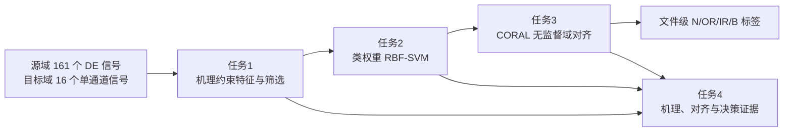

# 高速列车轴承智能故障诊断：模型方法对比与推荐

> 本文保留前一轮基础方法比较。重新选择的三层创新方案、最新首选路线和模型适配预处理，见[创新建模方案与模型适配预处理](创新建模方案与模型适配预处理.md)。后续模型实施以新报告为准。

本文件针对 2025 年中国研究生数学建模竞赛 E 题的四项任务，比较可行的方法并给出一条可直接实施的首选路线。它是建模方案，不包含已经运行的分类准确率、目标域预测标签或模型优劣结论；这些结果须在后续按同一划分实际运行后产生。

## 一、选择依据与统一约束

方法选择由题目要求和已完成的数据审计共同约束。源域有 161 个带标签文件，类别数为 OR 77、IR 40、B 40、N 4；每个文件可切为多个窗口，但窗口不是新的独立采集记录。目标域有 A—P 共 16 个无标签文件，每个文件为 32 kHz、8 s 单通道振动记录，题面只给出约 600 rpm 的转速。源域的 DE 通道覆盖全部 161 个文件，目标域测点名称没有给出；振动幅值物理单位及目标轴承几何参数也没有给出。

已生成的[预处理数据集](预处理数据集/README.md)提供两种输入：保留原采样率的去均值版本，以及统一到 12 kHz 的单通道对照版本。后者包含 1,196 个完整的一秒窗口，其中源域 1,068 个、目标域 128 个。重采样会丢失超过 6 kHz 的信息，因此原采样率数据应继续用于包络谱和高频共振特征的对照，而不能被 12 kHz 版本取代。

下列约束贯穿四问：

- 数据划分以**原始文件**为组。同一文件的窗口、通道和已确认时移相关的 DE/FE 记录不能跨训练、验证、测试组。
- 路径、文件编号、故障尺寸、载荷、源域测点、通道是否缺失等信息只用于审计与分组，不能输入分类器；其中多项会泄露源域标签，且目标域不可获得。
- 特征筛选、标准化、超参数选择和类别平衡只在当前源域训练折完成。目标域可无标签参与域对齐，但这属于针对给定 A—P 文件的传导式迁移，不能据此宣称对未来列车文件已有泛化性能。
- 目标域的字母 B、N 是文件编号，不是状态标签；不假定 16 个文件恰好均分四类，也不以人为配额修正预测。

本文件在每问列出三类备选方法以便比较，最终路线每问只保留一个主方法；候选方法不是要在同一最终模型中叠加使用。

## 二、任务 1：数据分析与故障特征提取

本问要完成源域数据选择、代表性信号分析和整体特征构造。它的输出不能只是一张时频图，也不能把源域目录标签、故障尺寸或目标域未知的轴承几何当成特征。

| 方法 | 核心思路 | 为什么适合本问；所需数据 | 优点 | 缺点 | 实现难度 |
|---|---|---|---|---|---|
| **A. 机理约束的时域—包络谱特征库，加训练集内筛选** | 对去均值窗口计算时域冲击、频谱形状和包络谱结构特征；对源域代表记录用已知几何和 RPM 核对 BPFO/BPFI/题面 BSF/FTF 的响应，再在训练集内以相关性剔除和 mRMR 选取少量特征。 | 需要源域 DE、RPM、源域轴承几何和标签；目标域只使用双方都可定义的特征。缺陷冲击及调制是题面给出的机理。包络分析也适合查看铁路轴承背景干扰下的周期冲击。[L2](https://doi.org/10.3901/JME.2025.06.249)、[L3](https://doi.org/10.1016/j.ymssp.2023.110270) | 特征含义清楚；可在小样本上稳定训练；可直接服务任务 4；计算量低。 | 特征设计需要人工核查；目标域几何未知，不能把源域理论故障频率的绝对位置直接当作目标域分类规则。 | 中 |
| **B. 小波包能量—熵特征** | 将窗口分解为多个频带，计算各子带能量比例、谱熵和能量熵，再用 Fisher 分数或互信息排序。 | 只需均匀采样的单通道窗口；适合冲击能量分散在多个频带、而单一 FFT 峰不稳定的情况。 | 对非平稳信号较灵活；特征维度可控；不依赖目标轴承几何。 | 小波基、层数和频带解释会影响结果；能量特征容易受增益和滤波边界影响，物理解释弱于包络谱。 | 中 |
| **C. 时频图像 + 轻量 CNN 表征** | 将 STFT 或连续小波变换生成的时频图输入卷积网络，由网络学习特征。 | 需要大量、跨工况且独立的带标签源域窗口，以及严格按文件分组的验证集；目标域还需同一图像构造规则。 | 可联合利用瞬态与频带结构；不必人工指定每个特征。 | 窗口数量会掩盖独立文件很少的事实，尤其 N 类只有 4 个文件；参数多、迁移解释较难，容易把源域采集条件学成捷径。 | 高 |

### 任务 1 推荐：方法 A

建议将“选源域”落实为**选择观测方案和特征口径**，而不是为追求整齐而删除大量文件：采用全部 161 个源域文件的 DE 通道作为主输入，目标域采用其唯一通道；源域 FE、BA 仅保留为代表性机理核验和质量审计，不把缺失通道补齐。该选择使源、目标两侧都使用单通道数据，避免 8 个源文件的 FE 缺失造成类别相关的补值模式。目标域测点未知，所以这是一项可复验的输入一致化选择，不是“目标通道等于 DE”的事实判断。

推荐的特征分两层构造：

1. **机理展示层**：在源域代表信号上用原采样率数据绘制时域冲击、功率谱和包络谱；利用源域 RPM 与几何量定位理论故障频率及其谐波，说明 OR 的近等周期冲击、IR 的转频调制、B 的公转/自旋调制。这一层用于解释，不直接移植源域轴承的绝对频率位置到目标域。
2. **迁移特征层**：在源、目标均可获得的一秒窗口上构造候选特征，如交流 RMS、均方根、峰峰值、峭度、偏度、峰值因子、谱熵、频谱质心、频带能量比例、包络谱峰度、包络谐波集中度和相对峰高。幅值相关特征与单位 RMS 后的形状特征并列保留，以实际验证决定是否保留能量信息。仅在源域训练折中删除高度相关列并用 mRMR 选 10—15 个特征；预处理已有的 6 个基础特征可以作为起点，但不是最终特征集合。

当原采样率的代表信号确实显示轮轨或周期干扰压过包络冲击时，再把倒频谱预白化与快速谱中值峭度图作为**敏感性对照**，而不默认施加给每条记录。列车轴箱研究指出轮轨激励及周期冲击会遮蔽轴承特征，并在该情景中使用了这一组合来选择共振参数。[L2](https://doi.org/10.3901/JME.2025.06.249) 这支持其作为噪声情景下的备选，而不足以证明本题所有记录都必须采用它。

## 三、任务 2：源域故障诊断

本问必须在任务 1 形成的、对目标域可定义的特征基础上，用源域标签诊断 N、OR、IR、B，并给出经文件分组隔离的评价。文件数不均衡，尤其 N 类只有 4 个，故不能用随机窗口划分后的总体准确率作为主要证据。

| 方法 | 核心思路 | 为什么适合本问；所需数据 | 优点 | 缺点 | 实现难度 |
|---|---|---|---|---|---|
| **A. 类权重 RBF 支持向量机（SVM）** | 对训练特征做 z-score 或稳健缩放，以类别权重惩罚少数类错误；用 RBF 核学习非线性边界，并把窗口输出聚合为文件标签。 | 适合中低维机理特征、独立文件数有限且类别边界可能非线性的情形；需要源域训练特征、标签和文件组。 | 参数少；小样本训练稳定；计算开销低；后续可直接与 CORAL 特征对齐衔接。 | 核参数与惩罚系数需要分组验证选择；原生解释不如线性模型直观；N 类只有 4 个文件使其召回估计不稳定。 | 低—中 |
| **B. 类平衡随机森林 / 极端随机树** | 多棵决策树在随机子特征上学习，使用类别权重或按类重采样；以树间投票与置换重要性输出结果。 | 适合候选特征含非线性和交互、且希望先查看特征重要性的情况；需要源域特征、标签和文件组。 | 对尺度不敏感；可给出特征重要性；调参比深度网络简单。 | 训练窗口相关时容易高估性能；特征重要性受相关变量分散；域偏移后树的阈值不一定稳定。 | 低—中 |
| **C. 一维 CNN / 残差收缩网络** | 直接从一秒波形学习卷积滤波器，残差收缩或注意力模块可抑制噪声。 | 需要原始窗口、较多独立工况和严格的按文件训练验证；可作为强表征能力的对照。深度诊断和跨工况方法在文献中已有充分讨论。[L1](https://doi.org/10.1109/tim.2023.3244237)、[L7](https://doi.org/10.1109/tii.2021.3078712) | 减少人工特征设计；能同时学习局部冲击与频带结构。 | 训练样本表面充足而独立文件不足；模型、优化和数据增强细节多；源域高分不保证跨域有效，解释成本较高。 | 高 |

### 任务 2 推荐：方法 A

令经过任务 1 选择的特征向量为 \(\boldsymbol{x}_i\)，全局类别为 \(c_i\in\{\mathrm{N},\mathrm{OR},\mathrm{IR},\mathrm{B}\}\)。采用一对一的 RBF-SVM，并使用类别权重 \(\omega_c\)；在任一二分类子问题中，将对应的类别编码为 \(y_i\in\{-1,+1\}\)，其软间隔目标可写为：

\[
\min_{\boldsymbol{w},b,\boldsymbol{\xi}}\ \frac{1}{2}\lVert\boldsymbol{w}\rVert^2+C\sum_i \omega_{c_i}\xi_i,
\quad y_i\bigl(\boldsymbol{w}^{\mathsf{T}}\phi(\boldsymbol{x}_i)+b\bigr)\geq1-\xi_i,\quad \xi_i\geq0.
\]

其中 \(C\) 与 RBF 核宽度 \(\gamma\) 只通过源域训练/验证文件选择。推荐以文件为组进行分层划分：先固定已有的 96/32/33 个源域训练、验证、测试文件，再用多次 `StratifiedGroupKFold` 作为稳定性补充；同一文件的一秒窗口全部留在同一折。窗口训练时给每个文件总权重相同，避免长记录因窗口多而主导损失。文件级标签由该文件窗口的类别概率或决策分数的中位数确定，不用窗口总票数替代独立样本数。

主要评价指标为按文件计算的宏平均 F1、各类召回率、混淆矩阵和**平衡准确率**；同时报告 N 类只有 4 个独立文件这一事实。若 SVM 与类平衡森林在同一文件划分上给出相近结果，保留 SVM 作为主模型，森林作为误差诊断和特征重要性对照，不为了增加模型数量而集成二者。

## 四、任务 3：无标签目标域迁移诊断

本问要吸收源域与目标域的分布差异，并为 A—P 输出标签。源域约 1,700—1,800 rpm、目标域约 600 rpm，且采样率、设备、测点与幅值尺度不同；因此直接把任务 2 分类器用于目标域只能作为未迁移基线。

| 方法 | 核心思路 | 为什么适合本问；所需数据 | 优点 | 缺点 | 实现难度 |
|---|---|---|---|---|---|
| **A. CORAL 特征协方差对齐 + 类权重 SVM** | 用无标签目标特征的均值与协方差，将源域训练特征作线性变换，使两域二阶统计量接近；再训练任务 2 的同类 SVM。 | 只需源域标签和目标域无标签特征，完全符合题面信息条件。CORAL 本身就是不需要目标标签的协方差对齐方法。[L6](https://ojs.aaai.org/index.php/AAAI/article/view/10306) | 线性、轻量、可复现；对齐前后可量化；没有深度网络的训练不稳定问题；与小样本特征分类匹配。 | 只能校正一、二阶分布差异；若目标域存在新类别、强非线性差异或错误伪标签，不能保证有效；需要正则化避免协方差病态。 | 中 |
| **B. TCA / JDA 核子空间迁移 + SVM** | 在再生核空间中寻找低维投影，降低最大均值差异（MMD）；JDA 还以迭代伪标签对齐类别条件分布。 | 适合怀疑分布差异非线性、且愿意将源/目标共同投影时；需要源标签、目标无标签特征及核参数。 | 比线性对齐更灵活；可作为 CORAL 失效时的第二选择。 | 子空间维数、核宽度和伪标签循环会增加选择偏差；16 个目标文件很少，错误伪标签可能被放大；解释不如 CORAL 直接。 | 中—高 |
| **C. MMD 或对抗式域适应的一维 CNN** | 以波形或时频图学习深层特征，同时最小化 MMD 或通过域判别器使表示域不变。 | 需要大量训练窗口、稳定的优化和明确的源/目标批次构造；文献中是重要的跨工况路线。[L1](https://doi.org/10.1109/tim.2023.3244237)、[L5](https://doi.org/10.1016/j.ress.2020.107050) | 可表达复杂的非线性域差异；能端到端处理波形。 | 本题目标域仅 16 个文件且无标签，参数、网络和对抗训练的选择空间大；很难区分“学到故障机理”与“过拟合域特征”，任务 4 的解释负担更重。 | 高 |

### 任务 3 推荐：方法 A

设源域训练特征矩阵为 \(\boldsymbol{X}_s\)，目标域无标签特征矩阵为 \(\boldsymbol{X}_t\)。先以源域训练折拟合特征缩放；随后按文件等权形成协方差 \(\boldsymbol{C}_s\)、\(\boldsymbol{C}_t\)，并加小的对角正则 \(\lambda\boldsymbol{I}\)。CORAL 的线性映射可记为：

\[
\boldsymbol{A}=(\boldsymbol{C}_s+\lambda\boldsymbol{I})^{-1/2}(\boldsymbol{C}_t+\lambda\boldsymbol{I})^{1/2},
\qquad \widetilde{\boldsymbol{X}}_s=(\boldsymbol{X}_s-\bar{\boldsymbol{x}}_s)\boldsymbol{A}+\bar{\boldsymbol{x}}_t.
\]

在 \(\widetilde{\boldsymbol{X}}_s\) 上重新训练任务 2 的类权重 SVM，再对 \(\boldsymbol{X}_t\) 的窗口作预测。每个目标文件用窗口决策分数的中位数汇总，输出 N/OR/IR/B 标签、窗口投票比例、类别间隔和预测熵。间隔小、窗口分歧大或两种预处理口径不一致的文件仍给出题目要求的标签，但同时标记为低稳定性，供任务 4 解释与后续人工复核。

CORAL 的使用边界需要写清：A—P 的全体无标签特征参与 \(\boldsymbol{C}_t\) 估计，因此最终模型针对这 16 个给定文件；任何未来新文件进入时应重新估计目标域统计量或另设外推验证。调参不使用目标伪标签。先在源域构造“代理迁移”检验：将 12 kHz DE 与 48 kHz DE 的 B、IR、OR 三类互作源/目标代理，统一至 12 kHz 后保留文件分组，比较无迁移与 CORAL 的文件级宏 F1 和协方差距离。N 类不能参与这一代理，因为 12 kHz DE 子集没有正常文件；该限制必须与结果一并报告。只有当对齐没有破坏源域验证性能、且代理检验显示合理改善或至少不恶化时，才把 CORAL 用于正式目标域。

## 五、任务 4：迁移诊断的可解释性

本问不是给分类器附一张热力图，而是让任务 1 的故障机理、任务 3 的对齐过程和 A—P 的具体决策形成可复核证据。工业诊断中的可解释性需要把信号处理或物理先验接回模型依据。[L4](https://doi.org/10.3901/JME.2024.12.001)

| 方法 | 核心思路 | 为什么适合本问；所需数据 | 优点 | 缺点 | 实现难度 |
|---|---|---|---|---|---|
| **A. 机理—对齐—文件决策证据链** | 事前锁定可解释特征；迁移时报告均值/协方差距离与对齐前后变化；事后将每个目标文件与各类源域原型、窗口分歧和代表性包络谱并列。 | 与任务 1 的机理特征、任务 3 的 CORAL 和 SVM 自然衔接；需要特征定义、对齐矩阵、窗口分数和代表性频谱。 | 直接回答题目允许的三个解释角度；证据可追溯到具体特征和文件；不依赖黑箱解释器。 | 不能证明预测必然正确；原型距离是解释辅助，不应替代 SVM 决策；需要谨慎处理目标几何未知。 | 中 |
| **B. 置换重要性 + 局部反事实扰动** | 在源域测试折置换一个特征，比较宏 F1 降幅；对单个目标文件在合理范围内改变一个特征，观察类别分数变化。 | 适合任意已训练分类器；需要训练/测试分数、特征分布和局部预测。 | 模型无关；可量化特征对源域性能和单文件预测的影响。 | 相关特征会分摊重要性；反事实可能落到物理上不合理的区域，不能被解释为真实故障成因。 | 中 |
| **C. 稀疏逻辑回归 / 小决策树替身模型** | 用少量特征训练透明分类器，或拟合任务 3 SVM 的输出，再给出系数或规则。 | 需要最终特征和 SVM 输出；适合需要一组简洁规则的展示。 | 规则直观，便于答辩和图表呈现。 | 替身若保真度不足，只解释替身而非主模型；线性边界可能牺牲诊断性能。 | 低—中 |

### 任务 4 推荐：方法 A，并以方法 B 作定量补充

首选解释报告按三层组织，且每层都使用实际运行后的数值，不预写“解释成功”的结论：

1. **事前解释**：列出每个保留特征的公式、量纲、计算窗口和对应机理。例如包络谱的谐波集中度描述重复冲击的周期性，峭度描述冲击性；说明哪些是形状特征、哪些保留幅值信息。源域理论频率仅用于源域机理核验，目标域不以未知几何生成伪物理结论。
2. **迁移过程解释**：报告对齐前后 \(\lVert\boldsymbol{C}_s-\boldsymbol{C}_t\rVert_F\)、各特征均值差和低维可视化；同时展示代理迁移中有无 CORAL 的文件级性能。协方差距离下降只表示选定特征的统计分布更接近，不能单独等同于目标域标签正确。
3. **事后解释**：逐个 A—P 文件给出最终标签、窗口类别分数分布、置信间隔、最有区分力的 2—3 个特征、与预测类源域原型的距离及一段代表性时域/包络谱图。再用源域测试折的置换重要性检查这些特征是否真正影响主模型的文件级宏 F1。

这种安排优先解释真正参与任务 3 的特征和变换，避免另训练一个复杂可解释网络来解释另一个模型。可解释特征和符号网络在轴承诊断中已被用于减小模型复杂度并提供特征归因，但这类深度方案更适合作为后续性能对照，而不宜在本题小独立样本条件下替代主路线。[L8](https://doi.org/10.3390/e27040403)

## 六、整题首选方案及理由

推荐的整题路线是：**机理约束的多域特征与训练集内筛选 → 文件等权的类权重 RBF-SVM → CORAL 无监督协方差对齐 → 机理—对齐—文件决策证据链**。

它不是为了将多个模型堆叠在一起，而是让每一环只解决一个必要问题：特征把冲击和调制机理变成双方可计算的量；SVM 在有限独立文件下完成源域非线性分类；CORAL 使用目标域无标签数据处理显著域差异；证据链回答迁移了什么、每个文件为何获得该标签。该路线的关键计算都可用 NumPy、SciPy 和 scikit-learn 在普通 CPU 上完成，参数数量与验证负担明显低于时频图深度网络或对抗域适应。

选择它还有四个具体原因：

1. **数据规模相称**：窗口可提高时间分辨率，却不能把 4 个正常文件变成大量独立正常样本。SVM 的容量与 10—15 个筛选特征相匹配；深度网络更适合作为后续严格分组的对照。
2. **题目结构相称**：任务 1 到任务 4 要求连续。特征、分类器、域对齐和解释使用同一数据对象，避免出现“前面用一套特征、后面解释另一套模型”的断链。
3. **可解释性相称**：目标域轴承几何、测点和真值未知，不能以绝对故障频率或深层注意力图给出过强结论。可追溯特征、协方差距离、代理迁移与文件级稳定性更容易说明证据边界。
4. **风险可控**：若 CORAL 的代理迁移检验没有改善，直接回退为同一特征 + 类权重 SVM 基线；若原采样率包络分析显示 12 kHz 重采样损失关键响应，则在特征层改用原采样率可比特征并重新完成源域训练折筛选。两种回退都不改变文件分组和评价口径。

深度域适应、TCA/JDA 和时频图 CNN 保留为严格分组下的对照方法。只有在代理迁移和源域文件级评估证明其稳定优于首选路线，并能补齐相同层级的解释证据时，才值得替换主模型。

## 七、后续实施清单与验证口径

| 阶段 | 必做产出 | 验证或停止条件 |
|---|---|---|
| 特征实现 | 特征定义表、源域代表性时域/频谱/包络谱图、训练折选择出的特征列表 | 若任何候选特征含路径、故障尺寸或不可得的目标域字段，删除；若重采样使关键机理响应不可见，回到原采样率特征。 |
| 源域诊断 | 文件分组、SVM 参数、文件级混淆矩阵、宏 F1、各类召回和平衡准确率 | 若随机窗口划分显著高于文件分组结果，以文件分组结果为准；N 类评价须显示其独立文件数量。 |
| 迁移诊断 | 无迁移基线、CORAL 参数、代理迁移对比、A—P 文件级预测及稳定性 | 若 CORAL 未通过代理迁移的预设比较，不把它作为正式主结果；不得以目标域伪标签调参。 |
| 可解释性 | 特征—机理表、对齐前后统计量、每文件决策卡、置换重要性 | 若一个解释特征对源域文件级性能没有贡献或与机理矛盾，不把它列为主要诊断依据。 |

源域测试结果只能评价源域文件的识别；代理迁移只能评价人为构造的已知条件差异；目标域 A—P 没有真值时，只能报告预测、稳定性和机制一致性。三者不能互相替代。

## 八、引用依据

- **[L1]** Chen, X. et al. *Deep Transfer Learning for Bearing Fault Diagnosis: A Systematic Review Since 2016*. IEEE Transactions on Instrumentation and Measurement, 2023. [DOI: 10.1109/TIM.2023.3244237](https://doi.org/10.1109/tim.2023.3244237)。用于界定跨域轴承诊断的路线，不把综述中的性能数据移用于本题。
- **[L2]** 刘文朋等. *轮轨激励下高速列车轴箱轴承故障诊断方法研究*. 机械工程学报, 2025. [DOI: 10.3901/JME.2025.06.249](https://doi.org/10.3901/JME.2025.06.249)。用于说明高速列车场景中轮轨激励和背景干扰会影响特征提取，以及 CPW—FMK 可作为抗干扰对照。
- **[L3]** Chen, B. et al. *Product envelope spectrum optimization-gram: An enhanced envelope analysis for rolling bearing fault diagnosis*. Mechanical Systems and Signal Processing, 2023. [DOI: 10.1016/j.ymssp.2023.110270](https://doi.org/10.1016/j.ymssp.2023.110270)。用于包络谱与循环平稳冲击特征的候选依据。
- **[L4]** 严如强等. *可解释人工智能在工业智能诊断中的挑战和机遇：先验赋能*. 机械工程学报, 2024. [DOI: 10.3901/JME.2024.12.001](https://doi.org/10.3901/JME.2024.12.001)。用于采用信号处理和物理先验组织解释的依据。
- **[L5]** Wang, X. et al. *Multi-scale Deep Intra-class Transfer Learning for Bearing Fault Diagnosis*. Reliability Engineering & System Safety, 2020. [DOI: 10.1016/j.ress.2020.107050](https://doi.org/10.1016/j.ress.2020.107050)。用于说明深度域适应可作为高复杂度对照。
- **[L6]** Sun, B., Feng, J., & Saenko, K. *Return of Frustratingly Easy Domain Adaptation*. AAAI, 2016. [DOI: 10.1609/aaai.v30i1.10306](https://doi.org/10.1609/aaai.v30i1.10306)。CORAL 的原始无监督协方差对齐方法。
- **[L7]** Chen, L. et al. *Adversarial Domain-Invariant Generalization: A Generic Domain-Regressive Framework for Bearing Fault Diagnosis Under Unseen Conditions*. IEEE Transactions on Industrial Informatics, 2021. [DOI: 10.1109/TII.2021.3078712](https://doi.org/10.1109/TII.2021.3078712)。用于将对抗式深度域适应保留为高复杂度对照。
- **[L8]** Rigas, Spyros, Papachristou, Michalis, Sotiropoulos, Ioannis, & Alexandridis, Georgios. *Explainable Fault Classification and Severity Diagnosis in Rotating Machinery Using Kolmogor–Arnold Networks*. Entropy, 2025, 27(4), 403. [DOI: 10.3390/e27040403](https://doi.org/10.3390/e27040403)。用于说明可解释深度模型可作为后续性能对照，不作为本题性能依据。

本地两个文献目录中的上述 PDF 已阅读并与其目录中的 DOI/arXiv 元数据核对。在线双引擎检索在当前环境因网络解析失败未返回候选；本文件因此仅引用本地已核验论文和 CORAL 的原始出版页。
