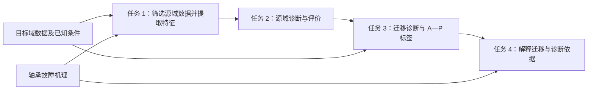

# 高速列车轴承智能故障诊断问题：题目分析与问题重述

本报告依据《2025 年中国研究生数学建模竞赛 E 题：高速列车轴承智能故障诊断问题》全文及当前目录的数据集，梳理题目背景、已知条件、四项任务及其关系，最后给出可单独使用的问题重述。当前阶段为读题与需求分析，模型选择、特征计算和诊断实验留待后续开展。

## 一、赛题与附件阅读范围

| 材料 | 已核对的内容 |
|---|---|
| `E题：高速列车轴承智能故障诊断问题.pdf`，共 9 页 | 背景与四项任务、两份内嵌附件、表 1—2、图 1—5、提交提示及题面参考文献 |
| `数据集/源域数据集/` | 全部 161 个 MAT 文件的目录分类、变量名称、数组尺寸、转速字段和数值完整性 |
| `数据集/目标域数据集/` | A—P 共 16 个 MAT 文件的变量名称、数组尺寸和数值完整性 |

附件 1“数据集介绍”和附件 2“概念介绍”均位于题目 PDF 内。以下“题目给定”指原文明确说明的条件，“数据核查”指本次直接读取本地文件得到的事实。所有数量均注明统计对象，文件数与信号采样点数分别表述。

## 二、题目背景与总体目标

### 2.1 为什么研究列车轴承诊断

轴承是高速列车走行系统的关键旋转部件，长期承受高转速、交变载荷等复杂工况。轴承损坏会影响列车运行，严重时危及行车安全，因此需要从监测信号中识别其工作状态与故障部位。题目以振动加速度信号为主要观测数据，将诊断任务落实为正常状态、外圈故障、内圈故障和滚动体故障的识别。以上背景来自题目第 1 页及附件 2。

### 2.2 题目中的实际困难

题目指出，实际运营环境中的振动信号混有背景噪声和其他干扰，故障特征容易受到遮蔽。同时，列车异常通常会被及时处理，真实故障数据难以充分积累，限制了直接依靠运营数据训练诊断模型的条件。

试验台架数据具有标签完备、相对丰富的优势，其故障机理与实际列车轴承相似，但设备、工况、采样条件等存在差异。本题要求利用这一联系，将台架数据中获得的诊断知识迁移到列车数据。因而，既要回答源域中能否识别故障，也要回答这些诊断依据如何用于目标域，以及目标域判断为何可信。

### 2.3 最终需要回答的问题

整题最终需要形成一条可追溯的诊断链：说明选择了哪些源域数据、提取了什么故障特征，评价源域诊断效果，再为目标域 A—P 各文件给出工作状态标签、迁移结果的可视化分析及机理相关解释。

这里的目标域标签属于待预测结果。题目没有提供其真实标签，因此源域测试效果与目标域预测结论应分别说明。

## 三、已知条件与本地数据情况

### 3.1 两个数据域的基本条件

| 项目 | 源域：轴承试验台架 | 目标域：实际列车轴承 |
|---|---|---|
| 文件数量 | 161 个 | 16 个，以 A—P 命名 |
| 状态类别 | 正常状态（Normal，N）、外圈故障（Outer Race Fault，OR）、内圈故障（Inner Race Fault，IR）、滚动体故障（Ball Fault，B） | 题目说明包含同样四种工作状态，各文件所属状态未知 |
| 标签信息 | 类别由题目说明、目录和文件名提供 | 未提供工作状态标签 |
| 采样条件 | 驱动端轴承数据有 12 kHz、48 kHz；风扇端轴承数据为 12 kHz | 32 kHz，每段采集 8 s |
| 工况信息 | 载荷为 0、1、2、3 马力；转速由文件字段或文件名提供 | 列车速度约 90 km/h，轴承转速约 600 rpm |
| 信号与环境 | 加速度传感器采集，题目说明存在轻微噪声 | 列车轴承振动信号，处于实际运营背景 |
| 故障生成条件 | 人为制造的单点故障，无复合故障；故障记录中每组仅一个轴承损坏 | 未给出与源域相同的人工缺陷尺寸或试验生成条件 |

本表的数量、类别和采样条件均见题目第 1—4 页。源域 MAT 文件数量与目标域文件编号已经本地核对。题目开头将目标域概称为“轴承故障文件”，附件 1 明确其包含正常状态，因此目标域诊断范围包括 N。

### 3.2 源域的类别、故障尺寸和测量位置

题面给出的源域类别数量为 OR 77 个、IR 40 个、B 40 个、N 4 个。各类文件数量不均衡，且正常状态文件较少。当前目录的实际分布如下。

| 本地子目录 | OR | IR | B | N | 合计 |
|---|---:|---:|---:|---:|---:|
| `12kHz_DE_data` | 28 | 16 | 16 | 0 | 60 |
| `12kHz_FE_data` | 21 | 12 | 12 | 0 | 45 |
| `48kHz_DE_data` | 28 | 12 | 12 | 0 | 52 |
| `48kHz_Normal_data` | 0 | 0 | 0 | 4 | 4 |
| 合计 | 77 | 40 | 40 | 4 | 161 |

故障尺寸和工况的已知信息如下。

- 外圈故障尺寸为 0.007、0.014、0.021 英寸；内圈和滚动体故障尺寸另有 0.028 英寸。这里的尺寸指人为缺损大小，与滚动体本身的直径不同。
- 外圈故障涉及 3 点钟、6 点钟、12 点钟三个点位，目录分别使用 `Orthogonal`、`Centered`、`Opposite`。它们与驱动端、风扇端、基座三个传感器位置是不同维度的信息。
- 文件名如 `B007_0.mat` 表示 0 马力载荷下、故障尺寸为 0.007 英寸的滚动体故障。编号和工况信息不应当作振动信号本身。

题目给出的试验轴承几何参数为：

| 试验轴承 | 所在位置 | 滚动体数 | 滚动体直径 | 轴承节径 |
|---|---|---:|---:|---:|
| SKF6205 | 驱动端 | 9 | 0.3126 英寸 | 1.537 英寸 |
| SKF6203 | 风扇端 | 9 | 0.2656 英寸 | 1.122 英寸 |

驱动端（Drive End，DE）、风扇端（Fan End，FE）和基座（Base，BA）是信号采集位置。题目说明，振动可以经转轴及结构传递，某一测点的信号也可能包含另一端轴承的故障响应。因此，“在哪个位置采集”与“哪个部位发生故障”需要分别识别。BA 在本题数据字段中指基座。

### 3.3 MAT 文件实际包含什么

MAT 是 MATLAB 数据文件格式。源域中常见变量为 `X编号_DE_time`、`X编号_FE_time`、`X编号_BA_time` 和含 `RPM` 的转速字段。其中 `time` 表示时间序列数据；本次读取的这些变量是振动采样值数组，不是另附的时间戳数组。RPM 表示每分钟转数（revolutions per minute），除以 60 可得到以 Hz 表示的转频。

直接读取全部源域文件后，得到以下事实：

| 核查项目 | 实际结果 | 对题目理解的影响 |
|---|---|---|
| 通道是否齐全 | 161 个文件有 DE，153 个有 FE，97 个有 BA；97 个文件含三通道，56 个含 DE、FE，8 个仅含 DE | 题面已说明文件所含数据种类不一致，不能将每个文件都理解为完整三通道记录 |
| 转速信息 | 151 个文件有 RPM 字段，字段值范围为 1718—1798 rpm；另 10 个文件的名称带有转速 | 转速信息需要区分字段来源与文件名来源 |
| 信号长度 | 各源域信号数组均为单列，但不同文件长度不同 | 不能把源域所有文件都视为相同采集时长 |
| 数值完整性 | 全部 177 个 MAT 文件均成功读取，数值字段未发现 NaN 或无穷值 | 只说明本次检查未发现此类数值缺失，不代表信号没有噪声或其他异常 |

10 个不含 RPM 字段的文件为：`12kHz_DE_data` 下 B、IR 两类全部 8 个 0.028 英寸故障文件，以及 `48kHz_Normal_data` 下 `N_1_(1772rpm).mat`、`N_2_(1750rpm).mat`。这些文件名分别保留了相应的转速信息。

源域长度的进一步核查显示：`12kHz_DE_data` 的各通道均为 96,000 点；`12kHz_FE_data` 中 44 个文件为 96,000 点、1 个为 121,168 点；`48kHz_DE_data` 中 47 个文件为 192,000 点，另 5 个长度不同；正常状态中 3 个文件为 384,000 点，`N_0.mat` 为 243,938 点。这些是本地数组长度事实，不据此补定题面未逐通道说明的采样条件。

目标域 A—P 每个文件仅含一个同名的数值变量，均为 256,000 行、1 列；采样点数与题面给出的 32 kHz、8 s 一致。文件内没有标签、转速或测点说明字段。例如，目标域 `B.mat` 的变量 B 只是文件对应的名称，并不表示已知为滚动体故障；`N.mat` 同样不表示已知为正常状态。

### 3.4 题目已经提供的机理知识

附件 2 给出了后续理解振动特征的物理依据：局部缺陷与滚动体接触时产生冲击，随轴承运转形成重复冲击及衰减响应。不同故障部位对应不同的冲击和调制特点。

| 故障部位 | 附件 2 的机理描述 | 读题时需要保留的条件 |
|---|---|---|
| 外圈 | 固定外圈上的缺陷与滚动体反复接触，理想信号表现为近似等周期、等幅值冲击 | 原文限定在载荷方向不变等理想条件下 |
| 内圈 | 缺陷随内圈旋转并周期性经过载荷区，冲击幅值受轴承转频调制 | 不能将理想幅值变化规律直接当作全部实测信号的结论 |
| 滚动体 | 缺陷随滚动体自旋与内外圈交替碰撞，波形受滚动体公转频率调制 | 自旋、公转以及缺陷碰撞的频率含义需要结合题面定义区分 |

题目第 5 页表 2 给出了外圈故障特征频率（Ball Pass Frequency on the Outer Race，BPFO）、内圈故障特征频率（Ball Pass Frequency on the Inner Race，BPFI）和题面称为滚动体故障特征频率的 BSF（Ball Spin Frequency）；第 7 页给出滚动体公转频率 FTF（Fundamental Train Frequency）的表达式。它们属于已提供的机理信息，本阶段记录其用途和出处。

表 1 将滚动体数记为 n，表 2 下方又用 n 表示轴承转速，并另用带下标的 N 表示滚动体个数。两处符号应按各自定义阅读。题面 BSF 的名称与具体表达式也应一起引用，后续计算时须先明确其与自旋频率的口径，不能仅凭缩写替换公式。

### 3.5 题目没有给定的内容

当前材料未给出目标域各类别的文件数量、各文件真实标签、目标域轴承的具体型号与几何尺寸、明确的测点位置，以及振动幅值的物理单位和标定关系。题面给出的约 600 rpm 是目标域转速说明，不是每个文件中已记录的精确转速。

此外，题目没有指定训练与测试的比例、必须采用的模型、特征维数或诊断准确率门槛。这些属于后续方案选择。台架轴承的几何参数、人工故障尺寸及单点故障设置，也不自动成为目标域的附加条件。

## 四、逐问分析：解决什么、已知什么、交付什么

### 4.1 任务 1：数据分析与故障特征提取

**需要解决的问题：** 面向后续目标域迁移诊断，从源域中选取哪些数据，以及这些数据包含哪些与轴承故障机理相关、可用于诊断的特征。

已知输入是带状态信息的源域振动数据、源域的轴承与工况说明，以及目标域的基本采样和运行条件。题目要求在筛选源域时考虑目标域的迁移任务，因此本问的数据选择与整题最终用途有关。

本问包含三个相连但不同的要求：

1. 从给定源域中筛选部分数据，组成后续使用的数据集。
2. 结合轴承故障机理，对有代表性的源域数据进行特征分析，说明所用方法或指标所反映的故障信息。
3. 对所组成的整体数据集提取特征，使其可以进入后续诊断任务。

最终需要得到所选数据及其依据、代表性信号的特征分析，以及所选整体数据集的特征表示。这里的“整体数据集”承接本问前面的数据筛选，不能仅分析少数示例就结束本问，也不宜直接解释为必须无差别使用全部 161 个文件。

题目允许改用其他公开轴承数据集作为源域；若采用，须注明出处，并按第 8 页提示提供数据集简介、相关链接和所选数据情况。时域、频域、时频域和二维图像是题面列举的分析维度，原文没有要求全部采用。

### 4.2 任务 2：源域故障诊断

**需要解决的问题：** 利用任务 1 的特征，能否对源域轴承工作状态进行有效识别，以及诊断效果如何。

已知输入是任务 1 形成的源域特征及相应状态标签。本问要求划分源域训练集与测试集，设计诊断模型并评价诊断结果。训练集用于形成诊断能力，测试集用于检验其在相应测试数据上的表现；具体划分规则和评价指标由后续工作确定。

最终需要得到训练与测试划分说明、源域诊断模型、测试诊断结果及其评价。评价对象仍是源域。即使源域表现良好，也需由任务 3 进一步回答如何适应目标域条件。

题目要求识别的是工作状态类别；故障尺寸、载荷、测点和转速是已知的数据条件，没有被单独指定为本问必须预测的目标。

### 4.3 任务 3：迁移诊断

**需要解决的问题：** 如何利用任务 2 的源域诊断模型，将诊断知识用于没有标签的列车轴承数据，并为各目标域文件确定工作状态。

已知输入包括任务 2 的诊断模型、源域数据与标签，以及目标域 A—P 的振动数据和基本工况说明。原文同时要求考虑两个域的共性与差异：共性包括故障部位及相近机理，差异包括已给出的采样条件、转速和设备环境等；实际信号特征与分布差异仍需后续分析。

最终需要得到适用于目标域无标签条件的迁移方法和目标域诊断模型，完成分类与标定，展示并分析迁移结果，同时给出 A—P 每个文件对应的标签。标签应能明确解释为 N、OR、IR、B 中的某一状态；若另用数字编码，还需给出编码对应关系。

本问有两个都要完成的输出：一是迁移结果的可视化展示与分析，二是数据与标签的明确对应。可视化不能替代逐文件标签。目标域各类别数量未知，16 个文件也不意味着每类恰好 4 个。没有目标域真实标签时，不能把预测标签视为真值，或直接报告目标域真实分类准确率。

### 4.4 任务 4：迁移诊断的可解释性

**需要解决的问题：** 任务 3 的模型为什么能够作出相应判断，迁移和诊断过程中有哪些与轴承故障特点及机理相联系的依据。

本问依托任务 3 的实际模型结构、迁移过程和决策过程，允许在以下角度中任选一项或多项。

| 可选角度 | 原文含义 | 对应需要回答的问题 |
|---|---|---|
| 事前可解释性 | 模型具有透明结构和决策逻辑，一般无需额外解释技术 | 模型的结构或规则如何使诊断依据可以被直接理解？ |
| 迁移过程可解释性 | 揭示源域到目标域的知识迁移路径与共享特征 | 迁移了什么知识，如何适应新工况或设备，哪些证据支持发生了有效迁移？ |
| 事后可解释性 | 借助外部工具或算法分析模型决策依据 | 模型为何把某个目标域文件判为相应状态，依据与故障机理如何对应？ |

最终需要形成围绕所选角度的解释分析，并将解释与任务 3 的具体模型及结果关联。题目允许任选，因而不必将三类解释全部设为强制任务。其要求也超出一般性的可解释性概念介绍：解释应能帮助诊断人员理解实际的迁移过程或诊断输出。

## 五、各问之间的递进关系

四问形成“数据与特征—源域诊断—目标域迁移—诊断解释”的关系，但任务 4 可从模型设计阶段就开始考虑。

| 关系 | 前问提供什么 | 后问在此基础上推进什么 |
|---|---|---|
| 任务 1 → 任务 2 | 所选源域数据、故障特征及标签对应 | 将特征用于诊断，并评价源域识别效果 |
| 任务 2 → 任务 3 | 已设计的源域诊断模型及其评价 | 面向目标域的不同条件设计迁移方法并生成标签 |
| 任务 3 → 任务 4 | 具体的迁移模型、迁移过程和诊断输出 | 解释知识迁移或状态判断的依据 |
| 目标域 → 任务 1 | 目标域的采样、工况及信号信息 | 使最初的数据筛选服务于迁移目的 |
| 故障机理 → 任务 1、4 | 缺陷引发冲击和调制的物理描述 | 支持特征含义分析，并支撑后续解释 |

前两问建立有标签源域上的诊断基础，第三问将其用于无标签目标域，第四问关注其透明性。后续若发现某些源域特征不适合迁移，可能需要回看任务 1；这种反馈来自任务之间的依赖，不是题面新增的独立小问。

## 六、整题最终成果清单

| 对应任务 | 最终成果 |
|---|---|
| 任务 1 | 所选源域数据说明、代表性数据特征分析、所选整体数据集的特征提取结果 |
| 任务 2 | 源域训练与测试划分、诊断模型、诊断结果及评价 |
| 任务 3 | 迁移方法与目标域诊断模型、迁移结果可视化及分析、A—P 各文件的预测标签 |
| 任务 4 | 事前、迁移过程、事后解释中至少一个角度的分析，并结合故障特点与机理 |
| 题面提交提示 | 与论文对应的源代码和数据集；使用其他源域时附数据集简介、链接及所选数据情况 |

本清单描述完整赛题后续应完成的工作。本次交付对应读题阶段，为本报告及配套的《术语表格》。论文的篇幅、格式和正式提交要求需在进入论文交付阶段时另行核验当届官方规则；题面没有给出的要求不加入本次问题重述。

## 七、问题重述

高速列车轴承长期处于高转速、交变载荷等复杂工况，其工作状态关系到列车运行安全。实际运营振动信号容易受到噪声和其他干扰，真实故障数据又较为稀缺；试验台架数据相对丰富、标签完备，且与列车轴承具有相似的故障机理。题目提供 161 个台架振动数据文件作为源域，以及 16 个实际列车轴承振动数据文件作为目标域，要求利用源域诊断知识完成目标域状态识别，并解释迁移与诊断依据。

源域包括正常状态、外圈故障、内圈故障和滚动体故障，涉及不同采样频率、测点、载荷与故障尺寸。目标域以 A—P 编号，采样频率为 32 kHz、每段时长为 8 s，列车速度约 90 km/h、轴承转速约 600 rpm，各文件的工作状态未知。需要完成以下四项任务。

1. 面向目标域迁移诊断，从给定源域中筛选部分数据组成数据集。结合轴承故障机理，对代表性源域数据进行特征分析，并对所组成的整体数据集提取特征，为后续诊断提供输入。若选用其他公开轴承数据作为源域，应注明出处，并说明数据集及所选数据情况。
2. 基于任务 1 得到的故障特征，划分源域训练集与测试集，设计诊断模型，完成源域轴承工作状态识别，并评价诊断结果。
3. 在任务 2 的诊断模型基础上，分析源域与目标域的共性和差异，设计适用于目标域无标签条件的迁移学习方法，构建目标域诊断模型。对目标域数据进行分类与标定，展示和分析迁移结果，并给出 A—P 各文件对应的工作状态标签。
4. 围绕任务 3 的模型结构、迁移过程或决策过程，结合轴承故障特点与机理，从事前可解释性、迁移过程可解释性和事后可解释性中选择一项或多项展开分析，说明迁移诊断的依据。

完整赛题成果还需附对应的源代码和数据集；使用其他源域数据时，报告应提供数据集简介、相关链接及所选数据情况。

## 八、原始依据定位

| 报告内容 | 直接依据 |
|---|---|
| 背景、数据规模、任务 1 | 题目 PDF 第 1 页 |
| 任务 2—4、三类可解释性定义 | 第 2 页 |
| 源域试验设置、测点与几何参数 | 附件 1，第 2—3 页 |
| 源域类别、故障尺寸、载荷；目标域条件 | 附件 1，第 4 页 |
| 轴承故障与振动机理、相关特征频率 | 附件 2，第 4—7 页 |
| 迁移学习概念、目标域无标签条件、成果提交提示 | 附件 2，第 7—8 页 |
| 题面所列参考文献 | 第 9 页；本报告仅确认题面列示，未将这些文献当作已阅读全文的外部论据 |
| 本地文件数量、通道、转速字段和数组长度 | 对 `数据集/` 全部 177 个 MAT 文件的只读核查，日期为 2026-09-20 |

原始题目 PDF 的 SHA-256 为 `d13f851ffd1f5a2017de40ba1a63dcf82809989591450b40cbf73f9c92adef58`。

## 九、问题三实施合同（2026-09-21）

本节将前述任务 3 的读题结论落实为可执行合同；数学细节见[问题三模型说明](问题三_数学模型与求解说明.md)。模型与验证口径在正式 A—P 预测前冻结，实际标签和性能须由真实程序输出填写。

| 合同项 | 问题三执行口径 |
|---|---|
| 任务定义 | 利用源域有标签诊断知识，对目标域 16 个无标签文件逐文件预测 N/OR/IR/B，展示并分析迁移；不把预测当真值。 |
| 数据 | 使用问题一筛选的 116 个源域 DE 文件及目标域 A—P；源域 70/23/23 原文件划分保持不变，目标每文件 32 kHz、8 s、约 600 rpm。问题一 20 转窗口特征表含 996 行，目标每文件 3 个完整窗。 |
| 结论类型 | A—P 各一项工作状态标签、四类分数、分数间隔、对齐或回退选择、稳定性标记及迁移前后图表；源域和代理评价与目标预测分开。 |
| 模型 | 一个源域文件级极端随机树诊断模型，加同一模型的机理分块部分 CORAL 输入映射；以强度 0 为无对齐基线。目标几何未知，故不用问题二 SKF6205 理论故障阶次。 |
| 数学定义 | 只保留 9 项无量纲形状与包络阶次量；源拟合文件给出中位数/IQR 尺度，源/目标文件等权估计两块收缩协方差；37→9 与 31→13 两个代理方向的三类宏 F1 按最差方向、平均方向和较小强度词典序选对齐强度。 |
| 实现 | Python 读取问题一窗口表、文件清单、原始目标 MAT（转速敏感性）；每文件中位数聚合，训练折内尺度与对齐，500 棵树拟合、预测、结果检验、出图与导出。 |
| 验证 | 12 kHz 训练故障文件→48 kHz 验证故障文件及反向代理只含 OR/IR/B；已见源固定测试分别评价未对齐基线和同映射对齐模型；目标留一重估和 540/600/660 rpm 特征重算只检查标签稳定性，目标真实准确率不可观测。 |
| 风险与回退 | 目标各类别比例、轴承结构和测点均未知；对齐可能因类别混合而负迁移。若代理选出强度 0，则报告未对齐迁移；目标不稳定文件仍输出标签并标记待复核。 |

数据适配依据是目标域无标定幅值：16 个目标文件的交流均方根、绝对均值、峰峰值中位数均落在 70 个源训练文件相应特征的 5%—95% 范围外。故本问不对未知幅值单位做物理换算，也不以幅值量训练目标分类器。其余 9 个无量纲量保留分布偏移供代理与对齐实验检验。关键假设是四类状态含义共享、题面近似转速足以定义观察窗；可放宽假设是九维共享特征和 16 文件协方差描述足够稳定，分别用代理、留一和转速扰动检验。
